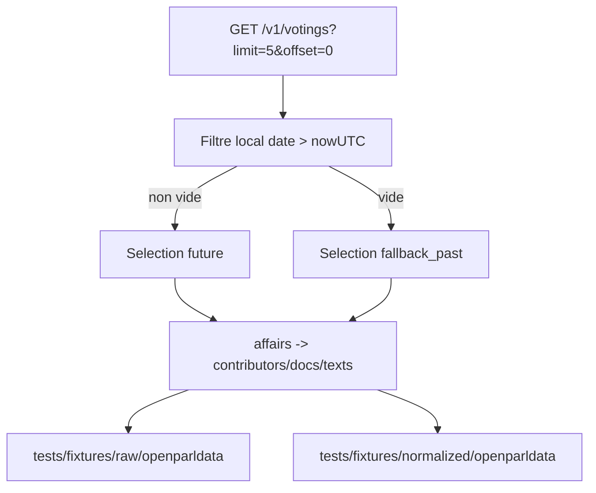

# Plan fixtures manual scraping

## Contexte
- Le fetcher de fixtures doit etre exploitable en mode test manuel avec un impact minimal sur l'API OpenParlData.
- Les votations futures peuvent etre absentes selon la date d'execution; un fallback test est necessaire.

## Objectifs
- Limiter la collecte a 5 votations (`limit=5`).
- Privilegier les votations futures quand elles existent.
- Basculer explicitement sur des votations passees/recentes si aucune future n'est disponible.
- Garder le meme enrichissement relationnel (`affairs`, `contributors`, `docs`, `texts`).

## Decisions principales
- Endpoint d'entree unique: `GET /v1/votings?limit=5&offset=0`.
- Filtrage de date applique cote client sur `voting.date > nowUTC`.
- Fallback explicite `fallback_past` pour garantir des fixtures de test.
- Sorties:
  - brut: `tests/fixtures/raw/openparldata/...`
  - normalise: `tests/fixtures/normalized/openparldata/...`

## Arborescence cible
- `backend/cmd/fetch-fixtures/main.go`
- `docs/fixtures.md`
- `docs/plans/PLAN-20260313-fixtures-manual-scraping.md`

## Modifications prevues
- `backend/cmd/fetch-fixtures/main.go`
  - remplacement du flux statique par un flux OpenParlData,
  - limite stricte a 5 votations,
  - ajout d'une selection `future` puis `fallback_past`,
  - serialisation normalisee par votation.
- `docs/fixtures.md`
  - alignement explicite sur `limit=5`,
  - documentation de la strategie fallback et des artefacts produits.

## Contraintes securite impactees
- Timeouts HTTP conserves.
- Taille de reponse limitee (`1.5 MB`) pour chaque requete.
- Aucune donnee utilisateur personnelle collectee.
- Journalisation technique uniquement (strategie de selection, compte de votations).

## Flux

## Verification post-generation
- [x] Le plan est present dans `docs/plans/`.
- [x] La limite `5` est explicite dans le code et la doc.
- [x] Le fallback `fallback_past` est documente et implemente.
- [x] Les chemins de sortie `tests/fixtures/raw` et `tests/fixtures/normalized` sont conserves.
