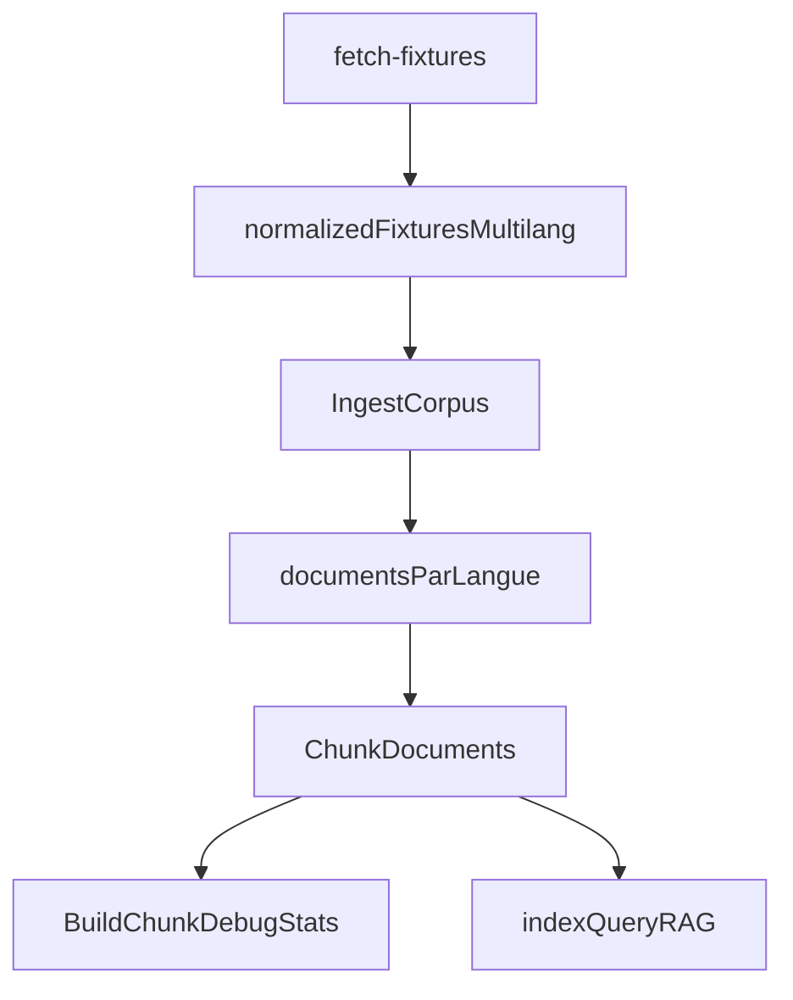

# Plan: integration multilingue RAG + fixtures

## Contexte
- Le debug `rag-debug-chunks` montre actuellement une langue unique (`fr`) alors que le contenu reeel contient plusieurs langues.
- La langue est aujourd'hui attribuee au niveau document JSON avec un choix unique, puis recopies dans les chunks.

## Objectifs
- Produire des documents/chunks par langue disponible.
- Conserver explicitement les variantes localisees dans les fixtures OpenParlData.
- Garantir des IDs de chunks uniques par traduction.
- Verifier le resultat avec `make rag-debug-chunks`.

## Decisions principales
- Etendre la normalisation des fixtures pour inclure des blocs localises et les langues detectees.
- Refactorer l'ingestion JSON RAG pour creer des variantes de `Document` par langue.
- Inclure `translation_id` dans l'ID de chunk pour eviter les collisions inter-langues.
- Ajouter des tests unitaires RAG sur ingestion/chunk/stats multilingues.

## Flux cible

## Fichiers cibles
- `backend/cmd/fetch-fixtures/main.go`
- `backend/internal/rag/ingest.go`
- `backend/internal/rag/chunk.go`
- `backend/internal/rag/chunk_test.go`
- `backend/internal/rag/debug_stats_test.go`
- `docs/fixtures.md`

## Verification post-implementation
- `make fixtures-fetch`
- `make rag-debug-chunks`
- `make rag-index`
- `make rag-query Q='Quels sont les arguments principaux ?'`
- `cd backend && go test ./...`
