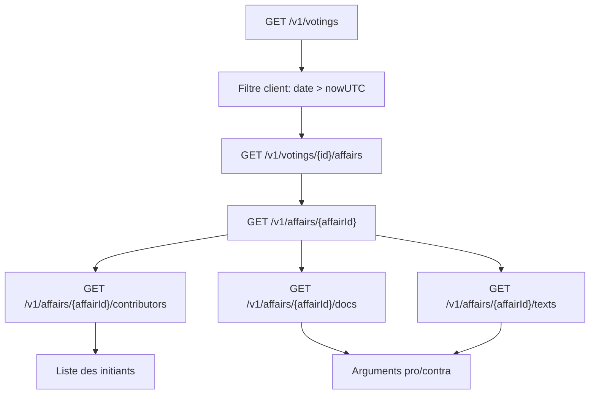

# Plan OpenParlData - votations futures

## Contexte
- Les fixtures actuelles sont encore basees sur des URLs statiques et ne suivent pas la structure relationnelle de l'API OpenParlData.
- L'endpoint `GET /v1/votings` fournit un point d'entree, mais les donnees utiles sont distribuees via des liens vers `affairs`, puis `contributors`, `docs` et `texts`.
- Le besoin fonctionnel cible les votations (pas les elections), avec extraction de titre, texte, initiants, arguments pro/contra.

## Objectifs
- Definir les endpoints OpenParlData minimaux a utiliser pour les votations.
- Formaliser une strategie fiable pour se concentrer sur les votations futures.
- Definir un mapping de donnees robuste avec fallbacks explicites.
- Aligner `docs/fixtures.md` sur ce flux relationnel.

## Decisions principales
- Source principale: `GET /v1/votings` (pagination `offset`/`limit`).
- Enrichissement obligatoire:
  - `GET /v1/votings/{votingId}/affairs`
  - `GET /v1/affairs/{affairId}`
  - `GET /v1/affairs/{affairId}/contributors`
  - `GET /v1/affairs/{affairId}/docs`
  - `GET /v1/affairs/{affairId}/texts`
- Le filtrage "futures" est applique cote client sur `voting.date > nowUTC`.
- Aucune bascule implicite vers une autre source si une relation est vide; appliquer des fallbacks de champ documentes.

## Arborescence cible
- `docs/plans/PLAN-20260313-openparldata-votations-futures.md`
- `docs/fixtures.md`

## Modifications de fichiers prevues
- `docs/plans/PLAN-20260313-openparldata-votations-futures.md`
  - formaliser endpoints, mapping, flux et checklist d'execution.
- `docs/fixtures.md`
  - remplacer les URLs statiques par une methode relationnelle OpenParlData,
  - documenter la selection des votations futures et les regles de fallback.

## Mapping des donnees
- **Titre de votation**: `votings.title.{fr|de|it}` (fallback de langue).
- **Contenu texte**:
  - priorite 1: `affairs/{id}/docs[].text`
  - priorite 2: `affairs/{id}/texts[].text.*`
  - priorite 3: `affairs/{id}/docs[].name` + `url`
- **Initiants**: `affairs/{id}/contributors` avec roles harmonises `Auteur/Urheber/in`.
- **Arguments pro/contra**:
  - extraction depuis `docs[].text` avec heuristiques lexicales (`Begrundung`, `Ablehnung`, `Antrag`, etc.),
  - fallback explicite `indisponible` si la polarite n'est pas clairement detectable.

## Flux technique

## Contraintes securite et privacy
- Ne jamais logger de donnees utilisateurs; uniquement metadonnees techniques necessaires.
- Limiter les tailles de contenus ingeres (`docs[].text`) pour eviter les charges excessives.
- Conserver uniquement des donnees politiques/administratives publiques.
- Ne pas exposer de secrets ni de tokens en clair.

## Verification post-generation
- [x] Plan present dans `docs/plans/` au format `PLAN-YYYYMMDD-<slug>.md`.
- [x] Endpoints votations et relations affaire identifies.
- [x] Regle "futures = filtre client sur `voting.date`" explicite.
- [x] Mapping titre/texte/initiants/arguments documente avec fallback.
- [x] Modifications prevues de `docs/fixtures.md` explicites.
