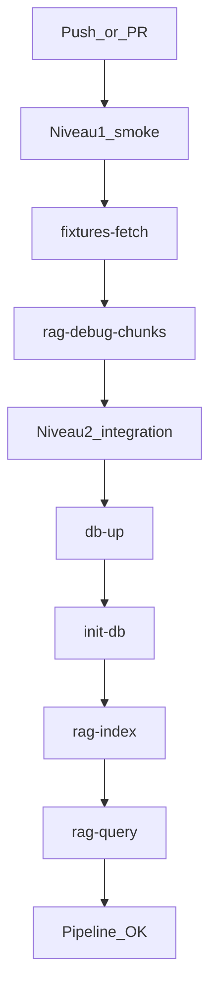

# Plan : pipeline RAG de tests en deux niveaux

## Contexte

- Le dépôt expose déjà des cibles utiles dans [Makefile](Makefile) : `fixtures-fetch`, `rag-debug-chunks`, `rag-index`, `rag-query`, `backend-test`, `db-up`, `init-db`, `bootstrap`.
- Il n'existe pas encore de cible composite qui enchaîne directement `fixtures-fetch` puis le debug RAG.
- Il n'existe pas encore de workflow GitHub CI dans `.github/workflows`.

## Objectifs

- Mettre en place un niveau 1 de vérification rapide, déterministe et sans DB.
- Ajouter un niveau 2 d'intégration avec PostgreSQL + pgvector pour valider l'indexation et la requête RAG.
- Rendre le pipeline exécutable de la même façon en local et en CI.

## Décisions principales

- Niveau 1 (smoke, sans DB) :
  - Enchaîner `fixtures-fetch` puis `rag-debug-chunks`.
  - Ajouter une cible Makefile dédiée (ex. : `rag-debug-pipeline`) qui accepte `CORPUS`/`SAMPLE`.
  - Garder ce niveau sans appel réseau LLM (mode déterministe via la configuration existante).
- Niveau 2 (intégration, avec DB) :
  - Démarrer la DB (`db-up`), initialiser le schéma (`init-db`), indexer (`rag-index`) puis tester une requête (`rag-query Q=...`).
  - Ajouter une cible Makefile dédiée (ex. : `rag-integration-pipeline`) et une cible agrégée (ex. : `rag-ci`).
- CI GitHub Actions:
  - Job `rag-smoke` pour niveau 1.
  - Job `rag-integration` pour niveau 2, avec service PostgreSQL + pgvector et étapes d'init explicites.

## Flux technique (2 niveaux)

## Arborescence cible

- [Makefile](Makefile) (nouvelles cibles composées + aide `make help`).
- [README.md](README.md) (section exécution locale des 2 niveaux + mapping CI).
- [.github/workflows/rag-pipeline.yml](.github/workflows/rag-pipeline.yml) (nouveau workflow CI en 2 jobs).

## Modifications de fichiers prévues

- [Makefile](Makefile)
  - Ajouter `rag-debug-pipeline` (niveau 1).
  - Ajouter `rag-integration-pipeline` (niveau 2).
  - Ajouter `rag-ci` (agrégée), et documenter dans `help`.
- [README.md](README.md)
  - Documenter les commandes locales :
    - `make rag-debug-pipeline`
    - `make rag-integration-pipeline`
    - `make rag-ci`
  - Préciser les prérequis `.env`/DB et les modes déterministes.
- [.github/workflows/rag-pipeline.yml](.github/workflows/rag-pipeline.yml)
  - Déclencher sur `push`/`pull_request`.
  - Job smoke: checkout, setup go, `make rag-debug-pipeline`.
  - Job integration: service postgres+pgvector, attente du healthcheck, `make init-db`, `make rag-index`, `make rag-query Q='...'`.

## Contraintes sécurité et privacy impactées

- Aucun ajout de données utilisateur ; pipeline limité aux fixtures politiques publiques ([docs/fixtures.md](docs/fixtures.md)).
- Pas de fallback implicite de mode RAG ; échec explicite si les prérequis d'intégration ne sont pas satisfaits.
- Logs CI limités aux métadonnées techniques (pas de secrets / prompt complet).

## Vérification post-génération (checklist exécutable)

- `make rag-debug-pipeline` passe localement sans DB.
- `make db-up && make init-db && make rag-integration-pipeline` passe localement.
- `make rag-ci` passe localement sur machine propre.
- Workflow CI `rag-pipeline.yml` vert sur PR test.
- README à jour avec commandes et prérequis.
