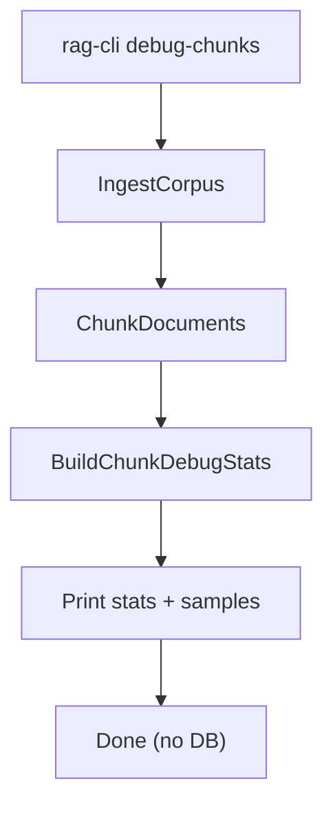

# Plan mode debugging RAG sans DB

## Contexte
- Le pipeline `rag-cli index` depent de PostgreSQL/pgvector apres ingestion et chunking.
- Pour debugger rapidement les fixtures et le parametrage de chunk, il faut un mode local sans DB.

## Objectifs
- Ajouter une commande `rag-cli debug-chunks`.
- Executer ingestion + chunking sans embeddings ni insertion DB.
- Afficher des statistiques utiles et des exemples de chunks.

## Decisions principales
- Reutiliser `IngestCorpus` et `ChunkDocuments` sans dupliquer la logique.
- Ajouter un module dedie aux stats dans `backend/internal/rag/debug_stats.go`.
- Garder `index` et `query` inchanges.

## Arborescence cible
- `backend/cmd/rag-cli/main.go`
- `backend/internal/rag/debug_stats.go`
- `backend/internal/rag/debug_stats_test.go`
- `README.md`
- `docs/plans/PLAN-20260313-rag-debug-chunking.md`

## Modifications prevues
- `rag-cli`:
  - nouveau sous-commande `debug-chunks`,
  - flags: `--corpus`, `--max-file-bytes`, `--chunk-size`, `--chunk-overlap`, `--sample`, `--top-docs`,
  - sortie: volumes, distribution langues/sources, top documents, echantillons.
- `internal/rag`:
  - fonction pure `BuildChunkDebugStats(documents, chunks)`.
- Tests:
  - agregations stats,
  - robustesse sur cas vide.
- README:
  - section explicite “Debug chunking sans DB”.

## Contraintes securite/qualite
- Aucune connexion DB dans `debug-chunks`.
- Pas de dump massif de contenu; seulement stats + echantillons limites.
- Validations de chunking conservees (taille/overlap).

## Flux

## Verification post-generation
- [x] `debug-chunks` disponible dans `rag-cli`.
- [x] Stats calculees hors DB.
- [x] Tests unitaires ajoutes pour stats.
- [x] README documente le nouveau mode.
- [x] Plan ecrit dans `docs/plans/` avec format `PLAN-YYYYMMDD-<slug>.md`.
