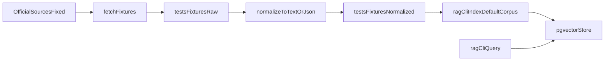

# Plan minimal fixtures RAG officielles

## Contexte
- Le pipeline RAG existe deja (`ingest`, `chunk`, `embed`, `query`) et la CLI `rag-cli` expose `index` + `query`.
- Il manque un corpus de fixtures officielles reproductible pour tester localement le flux complet.
- Les regles imposent des sources officielles documentees, un mode de collecte limite, et zero donnee personnelle.

## Objectifs
- Ajouter un outil Go `backend/cmd/fetch-fixtures` pour telecharger 1 a 3 ressources officielles fixes.
- Stocker les artefacts bruts dans `tests/fixtures/raw/`.
- Produire des fichiers normalises exploitables par le RAG dans `tests/fixtures/normalized/`.
- Adapter `rag-cli` pour indexer un dossier par defaut (`tests/fixtures/normalized/`) et interroger ce corpus via `query`.
- Documenter les URLs et la methode dans `docs/fixtures.md`.

## Decisions principales
- Source minimale obligatoire: une page de detail de votation depuis `abstimmungen.admin.ch`.
- Source open data additionnelle facultative: un JSON de reference depuis `opendata.swiss` (petit echantillon fixe).
- Aucune exploration automatique (pas de crawl): liste d'URLs hardcodee et bornage strict des requetes.
- Normalisation simple: extraction texte + metadonnees minimales, sans enrichissement complexe.

## Arborescence cible
- `backend/cmd/fetch-fixtures/main.go`
- `tests/fixtures/raw/`
- `tests/fixtures/normalized/`
- `docs/fixtures.md`
- `backend/cmd/rag-cli/main.go`
- `backend/internal/rag/ingest.go`

## Flux technique

## Securite et privacy
- Requetes HTTP avec timeout et limite de taille de reponse.
- Journalisation technique minimale, sans secret, sans donnees personnelles.
- Corpus limite a des contenus politiques/administratifs publics.

## Verification
- [ ] `cd backend && go run ./cmd/fetch-fixtures`
- [ ] fichiers generes dans `tests/fixtures/raw/` et `tests/fixtures/normalized/`
- [ ] `cd backend && go run ./cmd/rag-cli index`
- [ ] `cd backend && go run ./cmd/rag-cli query --q "Quel est l'objet de la votation ?"`
- [ ] documentation `docs/fixtures.md` complete
