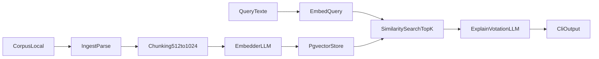

# Plan module RAG interne avec pgvector

## Contexte
Le backend Go suit deja une architecture par couches sous `internal/*` et une configuration centralisee dans `backend/config/config.go`. Le besoin est d'ajouter un pipeline RAG isole, avec stockage vectoriel PostgreSQL via `pgvector`, plus un CLI de test.

## Objectifs
- Ajouter un module `backend/internal/rag` decouple et testable.
- Indexer un corpus local de test (PDF/HTML/Markdown) via un binaire `rag-cli`.
- Executer une requete de test avec retrieval top-k et resume LLM.
- Respecter privacy-first: aucune donnee personnelle, aucun secret en dur.

## Decisions principales
- Utiliser PostgreSQL + extension `pgvector` pour le `VectorStore`.
- Garder des interfaces explicites:
  - `Embedder` pour embeddings LLM configurables.
  - `VectorStore` pour abstraction du stockage/recherche.
- Etendre la configuration pour inclure:
  - connexion Postgres (host, port, user, password, dbname, sslmode),
  - parametres RAG (chunk size, overlap, top-k),
  - parametres LLM embedding (URL, token, modele, timeout, limites).
- Journalisation technique minimale, sans tokens, sans prompts bruts sensibles.

## Arborescence cible
- `backend/internal/rag/ingest.go`
- `backend/internal/rag/chunk.go`
- `backend/internal/rag/embed.go`
- `backend/internal/rag/store.go`
- `backend/internal/rag/query.go`
- `backend/cmd/rag-cli/main.go`
- `backend/config/config.go`
- `backend/config/llm.example.yaml`
- `README.md`

## Modifications de fichiers prevues
- `backend/internal/rag/ingest.go`
  - ingestion de fichiers locaux et parsing texte avec metadonnees minimales.
- `backend/internal/rag/chunk.go`
  - chunking configurable (512-1024 tokens, overlap 10-20%).
- `backend/internal/rag/embed.go`
  - interface `Embedder` + implementation LLM configurable.
- `backend/internal/rag/store.go`
  - interface `VectorStore` + implementation Postgres `pgvector`.
- `backend/internal/rag/query.go`
  - `QueryRAG` (retrieval) et `ExplainVotation` (resume LLM).
- `backend/cmd/rag-cli/main.go`
  - commandes `index` et `query`, affichage des passages retrouves et du resume.
- `backend/config/config.go`
  - ajout des sections `Postgres` et `RAG`, et champs embedding LLM.
- `backend/config/llm.example.yaml`
  - exemple de config LLM + connexion Postgres pour `pgvector`.
- `README.md`
  - instructions de setup `pgvector`, config et usage de `rag-cli`.

## Contraintes securite et privacy impactees
- Le corpus indexe doit rester public/non personnel.
- Ne pas persister de donnees utilisateur identifiables.
- Ne jamais logger `LLM_API_KEY`, `LLM_EMBEDDING_API_KEY`, ni contenu sensible.
- Appliquer des limites d'entree (taille fichiers, taille prompts, timeout reseau).

## Flux technique

## Verification post-generation
- [ ] `go test ./...` passe dans `backend/`.
- [ ] `go vet ./...` passe dans `backend/`.
- [ ] Le schema SQL `pgvector` est initialise correctement.
- [ ] `go run ./cmd/rag-cli index --corpus <path>` indexe le corpus de test.
- [ ] `go run ./cmd/rag-cli query --q "<question>"` retourne des hits + un resume.
- [ ] Aucune fuite de secret/donnee personnelle dans les logs.
