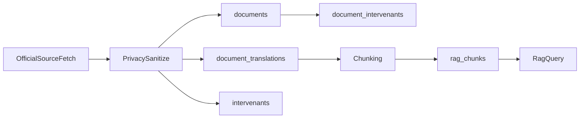

# Plan: refonte DB métadonnées multilingues (sans migration)

## Contexte

Le projet est en phase initiale, sans base de données existante ni données à préserver. On peut donc refondre le schéma directement, puis aligner toutes les structures applicatives sur ce nouveau modèle.

## Objectifs

- Reconcevoir la structure DB pour stocker proprement:
  - métadonnées de provenance,
  - langues (multilinguisme suisse),
  - intervenants (nom/prénom),
  - données RAG liées aux documents.
- Mettre à jour les structures Go (RAG + domaine/API) pour refléter ce modèle.
- Appliquer strictement la privacy: exclusion des emails et champs de contact.
- Mettre à jour le script d’init DB pour créer le nouveau schéma de référence.

## Décisions

- Modèle **hybride** retenu:
  - tables normalisées pour entités stables,
  - `JSONB` pour métadonnées variables.
- Pas de compatibilité rétroactive, pas de migration incrémentale: schéma unique cible.
- Langues codées ISO (`de`, `fr`, `it`, `rm`, `en`) avec table de traductions.

## Schéma DB cible

- Adapter `[scripts/sql/init_pgvector.sql](scripts/sql/init_pgvector.sql)` pour créer:
  - `documents` (provenance/source/external_id/licence/checksums/metadata_jsonb),
  - `document_translations` (`document_id`, `lang`, `title`, `summary`, `content_normalized`, `metadata_jsonb`),
  - `intervenants` (`prenom`, `nom`, `role`, `metadata_jsonb`),
  - `document_intervenants` (liaison + ordre/role de relation),
  - `rag_chunks` reliée aux documents/traductions + embeddings.
- Ajouter les contraintes/index structurants:
  - unique `(source_system, external_id)`,
  - unique `(document_id, lang)`,
  - index de liaison et index vectoriel HNSW.

## Mise à jour du script d’init DB

- Mettre à jour `[scripts/init-db.sh](scripts/init-db.sh)`:
  - conserver l’injection de `RAG_EMBEDDING_DIMENSIONS`,
  - appliquer le SQL refondu comme **source unique de vérité**,
  - conserver exécution idempotente et `ON_ERROR_STOP`.
- Vérifier la cohérence avec `[docker-compose.yml](docker-compose.yml)`, `.env` et la doc.

## Propagation dans le code Go

- RAG:
  - `[backend/internal/rag/ingest.go](backend/internal/rag/ingest.go)`: enrichir `Document` (langue, provenance, intervenants).
  - `[backend/internal/rag/chunk.go](backend/internal/rag/chunk.go)`: ajouter `Language` + références document.
  - `[backend/internal/rag/store.go](backend/internal/rag/store.go)`: adapter DDL/DML/queries au nouveau schéma.
  - `[backend/internal/rag/query.go](backend/internal/rag/query.go)`: intégrer langue/source/intervenants dans le contexte de réponse.
- Fixtures:
  - `[backend/cmd/fetch-fixtures/main.go](backend/cmd/fetch-fixtures/main.go)`: structurer les métadonnées en sortie normalisée et filtrer les emails.
- Domaine/API:
  - `[backend/internal/domain/votation.go](backend/internal/domain/votation.go)`: ajouter champs multilingues + intervenants.
  - `[backend/internal/ai/types.go](backend/internal/ai/types.go)`: aligner le contrat de sortie.

## Privacy et gouvernance des données

- Interdire la persistance de champs email/contact (`author_email`, `maintainer_email`, etc.).
- Conserver uniquement les données politiques/administratives et identifiants techniques de source.
- Ajouter une sanitation explicite avant persistance (whitelist des clés autorisées).

## Flux cible

## Documentation

- Mettre à jour `[docs/fixtures.md](docs/fixtures.md)` avec:
  - métadonnées conservées,
  - champs filtrés privacy,
  - prise en charge des langues.
- Mettre à jour `[README.md](README.md)` avec le nouveau modèle de données.

## Vérification

- Init DB complet via script mis à jour (`scripts/init-db.sh`) sans erreur.
- Schéma présent et contraintes/index effectifs.
- Ingestion crée des documents/traductions/intervenants/chunks cohérents.
- Aucun email stocké.
- Requête RAG exploite le corpus multilingue et retourne le contexte utile.
