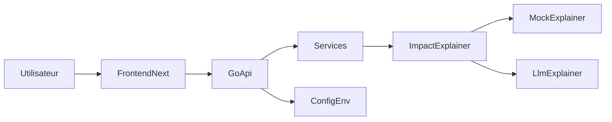

# Plan de squelette monorepo Civika

## Contexte
Le dépôt démarre vide. Le projet doit poser un PoC sécurisé en monorepo avec backend Go, frontend TypeScript SSR et exécution locale via Docker Compose.

## Objectifs
- Créer l'arborescence de référence backend/frontend/infra.
- Fournir des squelettes compilables sans logique métier.
- Intégrer les garde-fous de base de sécurité dès le bootstrap.

## Décisions principales
- Backend en Go avec `net/http` + `chi` pour un routage simple.
- Frontend en `Next.js` + TypeScript strict.
- Infra locale via `docker-compose` avec services `api` et `web`.
- Abstraction IA via `ImpactExplainer` avec implémentations mock et LLM (stubs).
- Configuration sensible uniquement via variables d'environnement (aucun secret en dur).

## Arborescence cible
- `backend/cmd/civika-api/main.go`
- `backend/go.mod`
- `backend/internal/domain/`
- `backend/internal/services/`
- `backend/internal/http/`
- `backend/internal/security/`
- `backend/internal/ai/`
- `backend/config/`
- `frontend/package.json`
- `frontend/tsconfig.json`
- `frontend/next.config.ts`
- `frontend/src/app/`
- `frontend/src/types/`
- `frontend/src/lib/`
- `backend/Dockerfile`
- `frontend/Dockerfile`
- `docker-compose.yml`
- `.env.example`
- `.gitignore`
- `README.md`

## Modifications de fichiers prévues
- `backend/cmd/civika-api/main.go`
- `backend/go.mod`
- `backend/internal/domain/*`
- `backend/internal/services/*`
- `backend/internal/http/*`
- `backend/internal/security/*`
- `backend/internal/ai/*`
- `backend/config/*`
- `frontend/package.json`
- `frontend/tsconfig.json`
- `frontend/next.config.ts`
- `frontend/src/app/*`
- `frontend/src/types/*`
- `frontend/src/lib/*`
- `backend/Dockerfile`
- `frontend/Dockerfile`
- `docker-compose.yml`
- `.env.example`
- `.gitignore`
- `README.md`

## Contenu de squelette a generer (sans logique metier)
### Backend
- `main.go` qui demarre le serveur HTTP avec timeouts et route `/health`.
- Types metier de base (`Votation`, `Question`, `Option`, `Resultat`, `ImpactScenario`).
- Package `internal/ai` avec:
  - interface `ImpactExplainer`,
  - `MockImpactExplainer` deterministe,
  - `LLMImpactExplainer` en stub.
- Package `internal/http` avec:
  - routeur principal,
  - middleware limite de body,
  - middleware headers de securite.
- Package `config` avec chargement des variables (`LLM_BASE_URL`, `LLM_API_KEY`, `LLM_MODEL_NAME`, timeouts, limites).

### Frontend
- App Next.js minimale (`layout`, `page`, `globals.css`).
- TypeScript strict et ESLint.
- Types API partages dans `src/types/api.ts`.
- Client API minimal dans `src/lib/api.ts`.

### Infra
- Dockerfiles backend/frontend.
- `docker-compose.yml` pour lancer `api` et `web`.
- Fichiers racine de bootstrap (`.env.example`, `.gitignore`, `README.md`).

## Flux d'architecture

## Verification post-generation
- [ ] Arborescence attendue presente.
- [ ] `go mod tidy` passe dans `backend/`.
- [ ] `go test ./...` passe dans `backend/`.
- [ ] `pnpm install` et `pnpm build` passent dans `frontend/`.
- [ ] `docker compose up --build` demarre les deux services.
- [ ] `GET /health` retourne un JSON valide.
