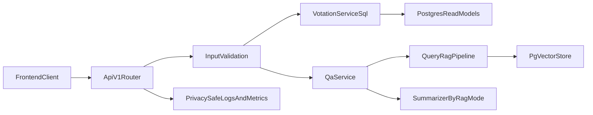

# Plan API Backend V1 (SQL-first, privacy-first)

## Contexte
- Le backend expose actuellement `GET /health` et le pipeline RAG fonctionne via CLI (`fetch-fixtures`, `rag-cli`).
- Objectif: livrer une API HTTP stateless pour exposition des données et QA/RAG, sans endpoints admin, en gardant sécurité et confidentialité au centre.
- Contrainte validée: source de vérité SQL dès V1, sans stockage de données utilisateur.

## Objectifs
- Exposer les endpoints backend V1: `GET /votations`, `GET /votations/{id}`, `GET /votations/{id}/objects`, `GET /objects/{objectId}`, `GET /objects/{objectId}/sources`, `GET /taxonomies`, `POST /qa/query`, `GET /health`, `GET /info` (optionnel).
- Intégrer explicitement les modes LLM/local dans l’API QA avec configuration stricte.
- Garantir que les champs nécessaires au filtrage/ordering API sont présents et exploitables dans les métadonnées RAG au moment du chunking et en base.
- Maintenir un backend strictement stateless vis-à-vis des utilisateurs finaux.

## Décisions principales
- API versionnée sous `/api/v1`.
- Périmètre V1 sans endpoints feedback.
- Lecture métier SQL-first depuis PostgreSQL (`documents`, `document_translations`, `intervenants`, `document_intervenants`, `rag_chunks`).
- Mode RAG explicite `RAG_MODE=local|llm` (pas de mélange implicite des composants).
- Si `RAG_MODE=llm` est mal configuré ou indisponible: erreur explicite, aucun fallback silencieux.

## Arborescence cible
- `backend/cmd/civika-api/main.go` pour wiring dépendances DB/services.
- `backend/internal/http/*` pour routeur, handlers, middlewares d’erreur/observabilité.
- `backend/internal/services/*` pour services métier concrets (votations/objects/qa).
- `backend/internal/rag/*` pour enrichissement métadonnées chunking et requêtes QA.
- `backend/internal/rag/store.go` et `scripts/sql/init_pgvector.sql` pour alignement schéma DB.
- `README.md` pour mode RAG, bascule, et procédure de réindexation.

## Modifications de fichiers prévues
- **Routing/handlers**
  - Étendre `backend/internal/http/router.go` avec routes `/api/v1`.
  - Étendre `backend/internal/http/handlers.go` avec validation stricte query/path/body, erreurs JSON normalisées, `DisallowUnknownFields`.
  - Ajouter middlewares `recover`, `request_id`, access logs privacy-safe.

- **Services SQL métier**
  - Implémenter services de lecture concrets sous `backend/internal/services` pour votations/objects/sources/taxonomies.
  - Ajouter couche repository SQL dédiée (nouveau package interne) pour isoler les requêtes.

- **QA/RAG + LLM**
  - Ajouter `POST /qa/query` stateless branché sur `QueryRAG` + summarizer.
  - Introduire `RAG_MODE` dans `backend/config/config.go` avec validation stricte des prérequis LLM.
  - Encadrer les appels LLM: timeout, limite taille prompt, logs sans prompt complet ni donnée sensible.

- **Métadonnées filtre/ordering (point obligatoire)**
  - Auditer les métadonnées actuelles injectées lors de l’ingestion/chunking (`backend/internal/rag/ingest.go`, `backend/internal/rag/chunk.go`, `backend/internal/rag/metadata.go`).
  - Définir un contrat minimal de métadonnées exploitables pour filtres/tri API, ex: `votation_id`, `object_id`, `level`, `canton`, `status`, `vote_date`, `language`, `source_type`, `source_org`, `tags`, `updated_at`.
  - Si certains champs sont absents ou coûteux à extraire via JSONB, étendre le schéma (`backend/internal/rag/store.go` + `scripts/sql/init_pgvector.sql`) avec colonnes normalisées/indexées côté `documents`/`document_translations`/`rag_chunks`.
  - Comme la base est vide, autoriser la modification directe du schéma d’initialisation sans migration rétrocompatible.
  - Ajouter indexes SQL alignés sur les filtres/ordering exposés (`date`, `level`, `canton`, `status`, `lang`, `object_id`).

- **Tests**
  - Tests unitaires handlers: validation/erreurs/body limit/unknown fields.
  - Tests services SQL: mapping, filtres, tri, pagination.
  - Tests intégration endpoints clés: cas nominal + erreurs DB/LLM + mode `local`/`llm`.
  - Tests de non-régression privacy: absence de persistance des questions/réponses et absence de logs sensibles.

- **Documentation**
  - Mettre à jour `README.md`: mode par défaut, variables LLM/RAG, bascule `local|llm`, procédure de réindexation si changement modèle/dimensions.

## Sécurité et confidentialité (exigences bloquantes)
- Validation explicite de toutes les entrées HTTP (path, query, body) avant logique métier.
- Body limit global + limites par champ sensible (notamment `question`).
- Réponses d’erreur sans détails internes ni stack traces.
- Logs techniques minimaux: endpoint, status, latence, request_id, identifiants techniques non personnels uniquement.
- Interdiction de logguer IP, prompts complets, payload utilisateur brut, tokens API.
- Aucune persistance de données utilisateur liées aux requêtes QA.

## Flux technique (mermaid)

## Checklist de vérification post-génération
- [ ] Les endpoints V1 répondent avec contrats JSON stables et codes HTTP cohérents.
- [ ] Le mode LLM est intégré côté API, strictement contrôlé par `RAG_MODE`.
- [ ] Les métadonnées nécessaires aux filtres/ordering sont présentes lors du chunking et accessibles efficacement en DB.
- [ ] Le schéma SQL et les indexes reflètent les besoins de filtrage/tri API (sans migration legacy, base vide).
- [ ] `go test ./...` passe sur backend (unit + intégration pertinents).
- [ ] Vérification manuelle: aucune persistance des questions/réponses utilisateur.
- [ ] Vérification manuelle: logs sans données personnelles ni secrets.

