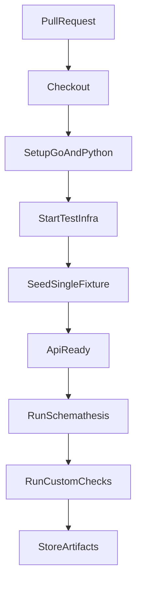

# Plan tests fonctionnels API (OpenAPI + Schemathesis)

## Contexte
- L'API backend expose des endpoints publics sous `/api/v1` avec validation d'entrees deja en place dans les handlers Go.
- Les tests unitaires HTTP couvrent plusieurs cas de validation, mais il manque une preuve CI orientee contrat API.
- Le projet impose une approche security-first et privacy-first, sans donnees utilisateur persistantes.

## Objectifs
- Ajouter un contrat OpenAPI V1 exploitable par un outillage de validation automatique.
- Integrer des tests fonctionnels API dans GitHub Actions pour verifier:
  - la conformite des reponses JSON,
  - les codes HTTP attendus,
  - la robustesse des controles d'inputs invalides.
- Documenter l'approche en `fr/en/de/it/rm`.

## Decisions principales
- Outil retenu: `Schemathesis` (tests contractuels + generation de cas).
- Contrat API stocke dans `docs/openapi/civika-api-v1.yaml`.
- Workflow CI dedie pour garder les checks lisibles.
- Acceleration pipeline RAG: injecter une seule fixture/document lors de la preparation des donnees.
- Aucun commit/push sans validation explicite humaine.

## Arborescence cible
- `docs/openapi/civika-api-v1.yaml`
- `scripts/tests/schemathesis.toml`
- `scripts/tests/checks.py`
- `.github/workflows/api-contract-tests.yml`
- `docs/api-functional-tests*.md` (5 langues)
- `Makefile` (cible locale `test-api-contract`)

## Modifications de fichiers prevues
- Ajouter la specification OpenAPI pour les routes publiques API.
- Ajouter la configuration Schemathesis et des checks complementaires.
- Ajouter un workflow GitHub Action dedie.
- Ajouter une cible Make pour lancer la validation contractuelle en local.
- Ajouter et indexer la documentation multilingue.

## Contraintes securite et privacy
- Ne pas logguer de secrets ni de donnees personnelles dans les jobs/tests.
- Garder des payloads de test anonymes.
- Verifier explicitement les erreurs de validation (`400`, `404`, `429`) sans exposer de details internes.
- Ne pas introduire de persistance de donnees liees a des utilisateurs.

## Flux technique

## Checklist de verification post-generation
- [ ] Le contrat OpenAPI couvre tous les endpoints publics V1.
- [ ] Les tests Schemathesis echouent sur violation de contrat.
- [ ] Les cas invalides critiques sont verifies (`limit`, dates, enums, body QA).
- [ ] Le workflow CI est executable sur PR et push `main`.
- [ ] La documentation est disponible en `fr/en/de/it/rm`.
- [ ] La preparation RAG en CI utilise une seule fixture/document.
