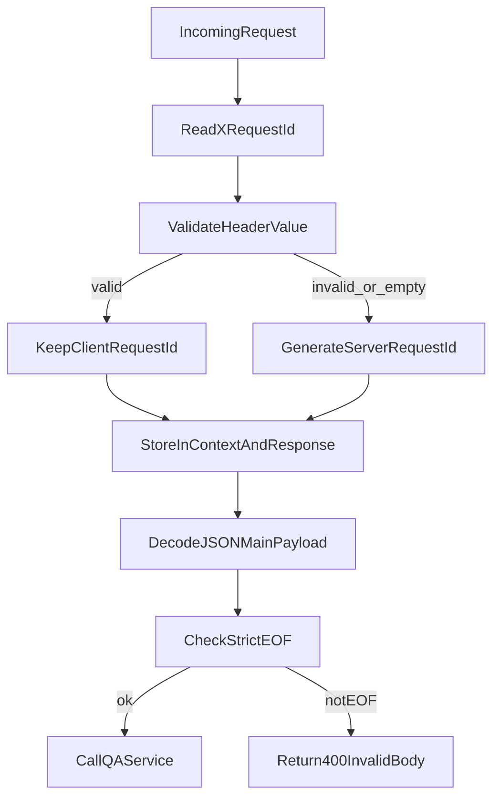

# Plan de remédiation CIV-SEC-004 et CIV-SEC-005

## Contexte
- Audit visé: [Audit sécurité Civika - 2026-03-14](../audits/20260314.md)
- Ce plan couvre explicitement les findings:
  - `CIV-SEC-004`: `X-Request-Id` non validé (spoofing/injection dans les logs).
  - `CIV-SEC-005`: parsing JSON non strict en fin de flux.

## Objectifs
- Corriger explicitement la faille `CIV-SEC-004` en imposant une validation stricte de `X-Request-Id` côté backend.
- Corriger explicitement la faille `CIV-SEC-005` en imposant un décodage JSON strict avec vérification EOF.
- Ajouter des tests de non-régression ciblés sur les deux vulnérabilités.

## Décisions principales
- `CIV-SEC-004`:
  - Accepter `X-Request-Id` fourni par le client uniquement s'il respecte une allowlist (charset + longueur).
  - Régénérer systématiquement un identifiant serveur si l'en-tête est absent ou invalide.
  - Continuer à propager l'ID retenu dans le contexte et la réponse HTTP pour la corrélation.
- `CIV-SEC-005`:
  - Conserver `DisallowUnknownFields()`.
  - Ajouter une seconde lecture JSON pour imposer une fin de flux stricte (EOF uniquement).
  - Rejeter tout payload contenant des données trailing.

## Arborescence cible
- `backend/internal/http/middleware.go`
- `backend/internal/http/handlers.go`
- `backend/internal/http/middleware_test.go`
- `backend/internal/http/handlers_test.go`

## Modifications de fichiers prévues
- [backend/internal/http/middleware.go](../../backend/internal/http/middleware.go)
  - Ajouter une fonction utilitaire de validation de `X-Request-Id`.
  - Modifier `requestIDMiddleware()` pour filtrer/régénérer l'identifiant.
- [backend/internal/http/handlers.go](../../backend/internal/http/handlers.go)
  - Renforcer `decodeQARequest()` avec un contrôle EOF strict après décodage principal.
- [backend/internal/http/middleware_test.go](../../backend/internal/http/middleware_test.go)
  - Ajouter des tests pour `X-Request-Id` valide, invalide, absent.
- [backend/internal/http/handlers_test.go](../../backend/internal/http/handlers_test.go)
  - Ajouter des tests pour accepter un JSON strict et refuser un JSON trailing.

## Flux de validation et parsing

## Contraintes sécurité impactées
- Intégrité des journaux: réduction du risque de spoofing/pollution des logs (`CIV-SEC-004`).
- Validation stricte des entrées: suppression des ambiguïtés de parsing et contournements (`CIV-SEC-005`).
- Maintien des erreurs API non verbeuses (pas d'exposition de détails internes).

## Vérification post-génération
- [ ] Exécuter `go test ./backend/internal/http -run "RequestID|QAQuery|Decode"`.
- [ ] Exécuter `go test ./...`.
- [ ] Vérifier l'absence de nouveaux diagnostics linter/IDE sur les fichiers modifiés.
- [ ] Vérifier manuellement que l'API retourne un `requestId` serveur en cas de header invalide.
- [ ] Vérifier manuellement qu'un body JSON avec trailing retourne `400 invalid_body`.
