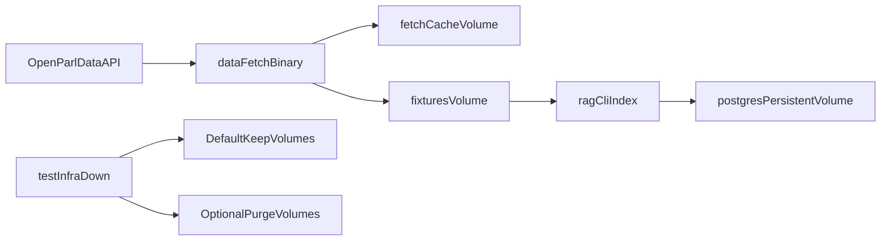

# Plan persistance infra + binaire data-fetch

## Contexte
- L'infra de test purge actuellement les volumes a chaque `test-infra-down`, ce qui empeche la persistance entre runs.
- Le fetch actuel (`backend/cmd/fetch-fixtures/main.go`) recrawl/retelecharge de maniere systematique.
- Le service `rag_chunker` est deja present dans `docker-compose.test.yml`, avec un volume fixtures, sans cache fetch dedie.

## Objectifs
- Conserver par defaut les donnees DB + fixtures + cache fetch entre runs.
- Ajouter un mode de purge explicite pour `test-infra-down`.
- Introduire un binaire `data-fetch` idempotent:
  - evite de reteledcharger ce qui est deja present,
  - verifie les liens de niveau 1 pour les sujets deja presents,
  - complete via recursivite BFS (profondeur max 3 par defaut, configurable).
- Compiler et exposer `data-fetch` dans l'image backend consommee par `rag_chunker`.

## Decisions principales
- Utiliser un cache local persistant filesystem (et non DB) pour la deduplication de fetch.
- Separer les volumes:
  - fixtures (`rag_fixtures`),
  - cache fetch (`rag_fetch_cache`),
  - postgres test (`postgres_test_data`).
- Definir un comportement de down explicite:
  - par defaut, conservation des volumes,
  - purge seulement via parametre explicite.

## Architecture cible

## Arborescence cible
- `backend/cmd/data-fetch/main.go`
- `backend/cmd/data-fetch/main_test.go`
- `docs/plans/PLAN-20260314-data-fetch-persistence.md`

## Modifications de fichiers prevues
- `docker-compose.test.yml`
  - ajouter volume Postgres persistant,
  - ajouter volume cache fetch persistant,
  - monter fixtures + cache dans `rag_chunker`.
- `Makefile`
  - `test-infra-down` conserve les volumes par defaut,
  - purge explicite via parametre (`PURGE_VOLUMES=1`) et cible dediee,
  - cibles `data-fetch` et `test-data-fetch`.
- `backend/Dockerfile`
  - build + copy du binaire `data-fetch`.
- `backend/cmd/data-fetch/main.go`
  - logique de fetch robuste reprise de `fetch-fixtures`,
  - cache persistant URL -> blob (manifest + blobs),
  - garde-fous de securite (allowlist, timeout, limites reponses).
- `scripts/tests/smoke-api.sh`
  - utiliser `/app/data-fetch` dans le conteneur `rag_chunker`.
- `README.md` et `docs/fixtures.md`
  - documenter nouvelle execution, volumes persistants, purge explicite.

## Contraintes securite impactees
- Validation stricte des flags/env (`max-depth`, TTL, chemins).
- Timeouts/retries limites et bornee.
- No silent fallback: erreurs explicites en cas de defaut reseau/IO.
- Journalisation technique sans payload sensible ni secret.

## Verification post-generation
- [ ] `make test-stack-up`
- [ ] `make test-data-fetch` (run 1)
- [ ] `make test-data-fetch` (run 2) et verifier presence de cache hit
- [ ] `make test-infra-down` puis `make test-stack-up` et verifier persistance
- [ ] `make test-infra-down PURGE_VOLUMES=1` et verifier suppression volumes
- [ ] `make test-api-smoke`
- [ ] `cd backend && go test ./...`
