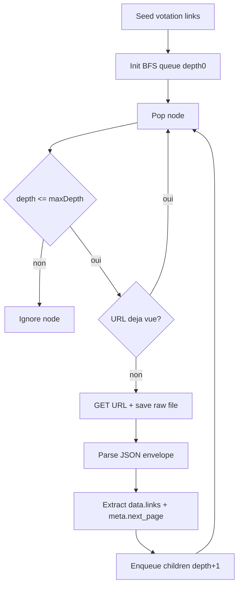

# Plan recursion fetch-fixtures OpenParlData

## Contexte
- Le fetcher actuel dans [backend/cmd/fetch-fixtures/main.go](backend/cmd/fetch-fixtures/main.go) suit un flux fixe (votings -> affairs -> contributors/docs/texts) sans recursion generique.
- Les fixtures brutes dans [tests/fixtures/raw/openparldata](tests/fixtures/raw/openparldata) montrent que des liens API exposes (ex: `votes`, `meeting`, `bodies`, `meta.next_page`) ne sont pas suivis.
- Objectif: garantir au moins 3 niveaux de profondeur par votation, de maniere explicite et configurable.

## Objectifs
- Ajouter un parametre de profondeur (`-max-depth`, defaut `3`) pour piloter la recursion.
- Suivre recursivement les liens JSON exposes (`links.*`) et la pagination (`meta.next_page`) jusqu'a la profondeur cible.
- Conserver un format de sortie brut stable et lisible pour l'analyse/debug.
- Preserver la generation du fixture normalise existant sans regression.
- Reduire fortement la pression sur l'API publique (throttling, retries, backoff, concurrency controlee).
- Exposer les limites de recursion et de debit dans la configuration persistante, avec override CLI.

## Decisions principales
- Exposer une configuration dediee `fetch-fixtures` via variables d'environnement:
  - `FETCH_FIXTURES_MAX_DEPTH` (defaut `3`),
  - `FETCH_FIXTURES_VOTINGS_LIMIT` (defaut `5`),
  - `FETCH_FIXTURES_MAX_NODES_PER_VOTING` (defaut prudent, ex: `150`),
  - `FETCH_FIXTURES_MIN_REQUEST_INTERVAL` (defaut `1s`),
  - `FETCH_FIXTURES_MAX_RETRIES` (defaut `3`),
  - `FETCH_FIXTURES_BACKOFF_MAX` (defaut `30s`).
- Regle de priorite de configuration: `flag CLI` > `env` > `valeur par defaut compilee`.
- Introduire un crawler deterministe (BFS) dans `fetch-fixtures`:
  - file d'attente de noeuds `{url, depth, relationHint}`,
  - ensemble `visited` pour eviter boucles et doublons,
  - arret strict si `depth > maxDepth`.
- Limiter le perimetre de recursion aux URLs OpenParlData (`https://api.openparldata.ch/`) pour eviter le suivi de liens externes non maitrises.
- Extraire les liens a partir de:
  - `data[].links` (toutes cles URL),
  - `meta.next_page`.
- Conserver des garde-fous techniques:
  - `maxResponseBytes` deja present,
  - borne `maxNodesPerVoting` (nouveau) pour limiter les cas pathologiques,
  - timeout HTTP inchange.
- Ajouter une politique de charge explicite:
  - concurrence par defaut a `1` (pas de parallele massif),
  - delai minimal entre requetes (`-min-request-interval`, defaut `1s`),
  - jitter aleatoire court (ex: `100-250ms`) pour eviter les rafales synchronisees,
  - support de `Retry-After` et backoff exponentiel sur `429`/`5xx` (bornes max),
  - option d'override manuel (`-min-request-interval`) pour ralentir davantage en cas de doute.
- Maintenir le pipeline de normalisation actuel (initiants/arguments/docs/texts) en lisant prioritairement les fichiers attendus deja utilises.

## Limites API documentees
- D'apres l'OpenAPI OpenParlData, une limite explicite `100 requetes/heure/IP` est documentee pour les endpoints analytics (`/v1/analytics/*`), avec reponse `429` en depassement.
- Aucune limite chiffrable globale n'est explicitement indiquee dans la spec pour les endpoints metier (`/v1/votings`, `/v1/affairs`, etc.).
- Decision conservative: appliquer un throttling strict meme sans quota officiel sur ces endpoints metier.

## Flux technique

## Arborescence cible
- Plan: [docs/plans/PLAN-20260314-fetch-fixtures-recursion.md](docs/plans/PLAN-20260314-fetch-fixtures-recursion.md)
- Code: [backend/cmd/fetch-fixtures/main.go](backend/cmd/fetch-fixtures/main.go)
- Fixtures raw attendues: [tests/fixtures/raw/openparldata](tests/fixtures/raw/openparldata)
- Documentation usage: [README.md](README.md)

## Modifications de fichiers prevues
- [backend/cmd/fetch-fixtures/main.go](backend/cmd/fetch-fixtures/main.go)
  - ajouter parsing des flags (`-max-depth`, `-votings-limit`, `-max-nodes-per-voting`, `-min-request-interval`, `-max-retries`, `-backoff-max`),
  - ajouter lecture des variables d'environnement `FETCH_FIXTURES_*`,
  - appliquer la priorite `CLI > ENV > default` dans une structure `fetchConfig`,
  - ajouter structures internes de crawl (`crawlNode`, `crawlResult`),
  - implementer extraction generique des liens JSON,
  - implementer BFS et ecriture des fichiers bruts avec nommage par profondeur,
  - raccorder la normalisation existante aux fichiers cibles requis,
  - centraliser `fetchURL` avec throttling + retry policy.
- [README.md](README.md)
  - documenter nouveaux parametres de recursion,
  - documenter limites et comportement en cas de profondeur insuffisante,
  - documenter la politique de charge API et les valeurs par defaut,
  - documenter les variables `FETCH_FIXTURES_*` et des exemples d'override ponctuel via flags.

## Contraintes securite et privacy
- Ne jamais logger de contenu brut sensible inutile; limiter aux metadonnees techniques (URL, profondeur, compteurs).
- Refuser le suivi de domaines hors OpenParlData.
- Garder les limites de taille/volume (`maxResponseBytes`, `maxNodesPerVoting`) pour reduire le risque DoS.
- Garder un debit volontairement faible et un mode mono-worker par defaut pour respecter un service public gratuit.
- Ne pas introduire de persistance de donnees utilisateurs; uniquement des donnees publiques politiques.

## Verification post-generation
- [ ] Le fetcher suit au moins 3 niveaux quand `-max-depth=3`.
- [ ] Les liens `links.*` et `meta.next_page` sont suivis et de-dupliques.
- [ ] Aucun lien externe a OpenParlData n'est suivi.
- [ ] Les tests de charge montrent un debit effectif conforme au `min-request-interval` configure.
- [ ] Les reponses `429`/`5xx` sont gerees par retries limites + backoff, sans boucle infinie.
- [ ] La generation normalisee reste validee (meme schema JSON en sortie).
- [ ] Les fixtures brutes montrent explicitement des fichiers multi-niveaux pour une votation.
- [ ] La doc d'utilisation est a jour (flags et exemples).
- [ ] La priorite `CLI > ENV > default` est testee (au moins un cas par niveau).
