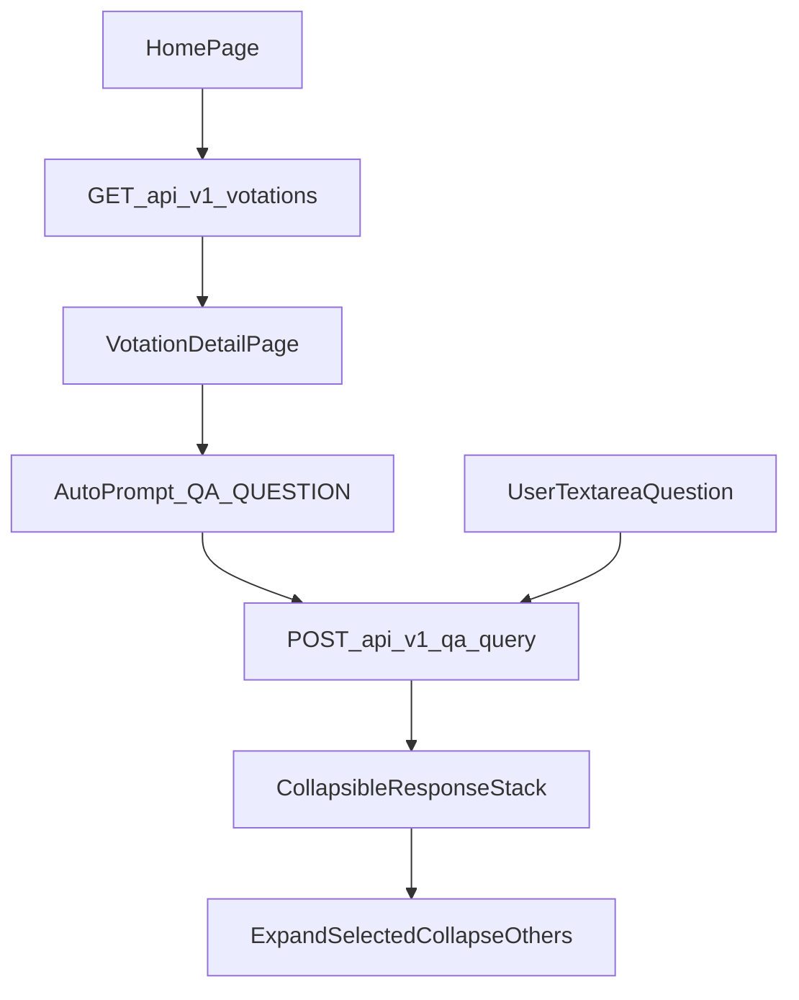

# Plan Frontend léger Votations + Q&A

## Contexte

- Le frontend existe déjà en squelette Next.js/TypeScript strict et n’appelle aujourd’hui que `GET /health` via [`frontend/src/lib/api.ts`](frontend/src/lib/api.ts).
- L’API backend expose déjà les routes métier nécessaires (`/api/v1/votations`, `/api/v1/votations/{id}`, `POST /api/v1/qa/query`).
- Le smoke test fournit une question par défaut pertinente: `QA_QUESTION="Quels sont les enjeux principaux de cette votation ?"` dans [`scripts/tests/smoke-api.sh`](scripts/tests/smoke-api.sh).

## Objectifs

- Page d’arrivée: afficher les votations les plus récentes en premier.
- Vue votation: lancer automatiquement une première Q&A (résumé initial) au chargement.
- Permettre des questions complémentaires via textarea + envoi.
- Afficher l’historique de réponses en pile, avec mode collapse (une ligne résumée) et ouverture exclusive de la réponse active.

## Décisions principales

- Conserver la stack actuelle (Next.js App Router + TypeScript strict), sans ajout de librairie UI lourde.
- Ajouter une route détail dédiée (`/votations/[id]`) et garder la page d’accueil comme listing principal.
- Utiliser exclusivement les endpoints backend existants, sans nouvelle API côté serveur frontend.
- État de conversation uniquement en mémoire côté client (pas de persistance locale, pas de cookie applicatif), conforme privacy-first.
- Encapsuler les appels API dans une couche typée partagée avec gestion d’erreurs explicite et messages neutres (sans fuite technique interne).

## Arborescence cible

- Listing:
  - [`frontend/src/app/page.tsx`](frontend/src/app/page.tsx)
- Détail votation:
  - [`frontend/src/app/votations/[id]/page.tsx`](frontend/src/app/votations/[id]/page.tsx)
- Composants UI légers:
  - [`frontend/src/components/votations/VotationList.tsx`](frontend/src/components/votations/VotationList.tsx)
  - [`frontend/src/components/qa/QAComposer.tsx`](frontend/src/components/qa/QAComposer.tsx)
  - [`frontend/src/components/qa/QAResponseStack.tsx`](frontend/src/components/qa/QAResponseStack.tsx)
- API client + types:
  - [`frontend/src/lib/api.ts`](frontend/src/lib/api.ts)
  - [`frontend/src/types/api.ts`](frontend/src/types/api.ts)
- Styles ciblés:
  - [`frontend/src/app/globals.css`](frontend/src/app/globals.css)

## Modifications de fichiers prévues

- **API client (`frontend/src/lib/api.ts`)**
  - Ajouter fonctions typées: `getVotations`, `getVotationById`, `queryQA`.
  - Centraliser `baseUrl`, timeout raisonnable côté client, `cache: "no-store"` pour données dynamiques.
  - Normaliser les erreurs fetch/HTTP en structure frontend minimale (`code`, `message`).
- **Types partagés (`frontend/src/types/api.ts`)**
  - Étendre les types pour coller aux payloads backend V1 (`VotationListResult`, `VotationDetail`, `QAQueryInput`, `QAQueryOutput`, `ApiError`).
  - Garder des types stricts, sans `any` implicite.
- **Page d’accueil (`frontend/src/app/page.tsx`)**
  - Remplacer la vue “health only” par un listing votations trié décroissant sur date.
  - Prévoir états `loading`/`empty`/`error` sobres.
  - Lien de navigation vers `/votations/[id]`.
- **Vue votation (`frontend/src/app/votations/[id]/page.tsx`)**
  - Charger le détail votation au montage.
  - Déclencher automatiquement une requête `POST /api/v1/qa/query` avec question par défaut issue du smoke test.
  - Afficher ensuite l’historique de réponses (la plus récente en bas, visible; anciennes collapsées).
- **Composants Q&A**
  - `QAComposer`: textarea + bouton envoyer, validation locale (non vide, longueur max cohérente backend).
  - `QAResponseStack`: cartes collapsables avec résumé 1 ligne; clic = étendre la carte ciblée et réduire les autres.
  - Générer un résumé court côté UI (ex: première phrase nettoyée/tronquée) sans stocker durablement.
- **Styles (`frontend/src/app/globals.css`)**
  - Ajouter styles minimalistes lisibles (liste, cartes, états, collapse), responsive simple.

## Sécurité et privacy à respecter

- Ne pas persister les questions/réponses utilisateur côté serveur ni dans des mécanismes de tracking frontend.
- Ne pas logger les prompts/réponses dans la console en production.
- Échapper/rendre les réponses en texte brut React (pas de `dangerouslySetInnerHTML`).
- Validation locale de base avant appel API (question vide/longue), en complément de la validation backend.
- Messages d’erreur utilisateur génériques, sans détails internes (stack, endpoint interne, token, etc.).

## Flux UX/technique

## Vérification post-implémentation

- `pnpm lint` passe sur le frontend.
- `pnpm typecheck` (ou `tsc --noEmit`) passe sans assouplir TypeScript.
- La home affiche les votations triées décroissantes.
- La page `/votations/[id]` lance bien une Q&A initiale automatique.
- Une nouvelle question ajoute une réponse en bas de pile.
- Le collapse affiche un résumé en une ligne et n’ouvre qu’une carte à la fois.
- Aucun stockage utilisateur ajouté (cookies tracking, stockage serveur, profilage).
- Aucune régression d’usage backend (`/health`, `/api/v1/votations`, `/api/v1/qa/query`).
