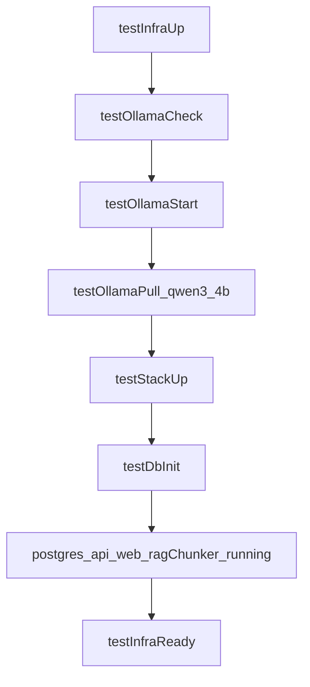

# Plan : infra de tests complete (Ollama + Compose dedie)

## Contexte

- Le depot dispose deja de [Makefile](Makefile), [docker-compose.yml](docker-compose.yml) et [scripts/init-db.sh](scripts/init-db.sh), mais sans cible unique "infra test complete".
- Le support Ollama n'est pas encore integre dans les cibles d'orchestration.
- Le mode retenu pour ce plan est Ollama via CLI hote avec le modele `qwen3:4b` (Mac M2).

## Objectifs

- Ajouter une cible Makefile agregée pour:
  - verifier la CLI Ollama,
  - demarrer/valider le service Ollama,
  - tirer `qwen3:4b`,
  - demarrer une stack Docker de test dediee,
  - initialiser PostgreSQL+pgvector,
  - lancer `api` + `web`,
  - exposer un conteneur de chunking qui reste en attente.
- Isoler la configuration de test avec `docker-compose.test.yml` et `.env.test`.
- Garder cet environnement jetable, sans volume persistant.

## Decisions principales

- Cibles Makefile dediees (`test-ollama-check`, `test-ollama-start`, `test-ollama-pull`, `test-stack-up`, `test-db-init`, `test-infra-up`, `test-infra-logs`, `test-infra-down`).
- Nouveau compose dedie test pour separer l'environnement local habituel et l'environnement de test.
- Nouveau `.env.test` explicite pour les mots de passe dev temporaires et la config Ollama (`host.docker.internal`).
- Container `rag_chunker` maintenu actif avec une commande bloquante.
- Pas de fallback implicite en cas d'echec Ollama/modele.

## Flux technique

## Arborescence cible

- [Makefile](Makefile)
- [docker-compose.test.yml](docker-compose.test.yml)
- [.env.test](.env.test)
- [scripts/init-db.sh](scripts/init-db.sh)
- [README.md](README.md)

## Modifications prevues

- [Makefile](Makefile): nouvelles cibles test et variables dediees.
- [docker-compose.test.yml](docker-compose.test.yml): stack test `postgres`, `api`, `web`, `rag_chunker`, sans persistance.
- [.env.test](.env.test): config test jetable pour DB + LLM/Ollama.
- [scripts/init-db.sh](scripts/init-db.sh): support `ENV_FILE` et `COMPOSE_FILE`.
- [README.md](README.md): procedure complete de demarrage/arret de l'infra de tests.

## Contraintes securite et privacy

- Aucune donnee utilisateur stockee.
- Mots de passe en dur autorises uniquement dans `.env.test` (dev temporaire).
- Logs limites a des informations techniques.
- Echec explicite si Ollama ou le modele sont indisponibles.

## Verification post-generation

- `make test-ollama-check`
- `make test-ollama-start`
- `make test-ollama-pull`
- `make test-infra-up`
- `make test-db-init`
- `make test-infra-down`
