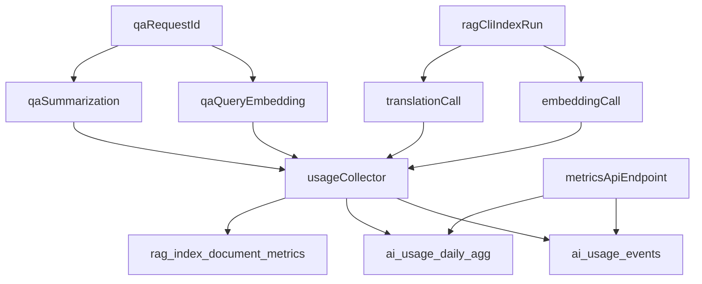

# Plan d'implementation: metriques tokens RAG + API

## Contexte
- Le pipeline RAG et QA utilise des appels embeddings et LLM mais ne persiste pas encore une metrique tokens exploitable.
- Le projet impose une approche privacy-first: aucune donnee personnelle ou contenu utilisateur ne doit etre persiste.
- Besoin fonctionnel: stocker des metriques anonymes, exposees via API JSON pour projection de cout externe.

## Objectifs
- Mesurer les tokens d'entree/sortie/total pour:
  - `rag-cli index` (embeddings + traduction),
  - `POST /api/v1/qa/query` (embedding de question + resume LLM).
- Persister:
  - evenements techniques granulaire,
  - agregats journaliers,
  - statistiques document d'indexation.
- Exposer un endpoint read-only de consultation/export JSON.

## Decisions principales
- Les metriques sont stockees en SQL dans des tables dediees sans identifiant personnel.
- Les compteurs de longueur sont en caracteres (`*_chars`) et non en texte brut.
- Le parsing de `usage` supporte formats OpenAI compatibles:
  - `prompt_tokens`/`completion_tokens`/`total_tokens`,
  - `input_tokens`/`output_tokens`/`total_tokens`.
- Quand l'usage provider est absent, le statut est `usage_source=unknown`.

## Arborescence cible
- `backend/internal/rag/usage_metrics.go`
- `backend/internal/rag/usage_metrics_test.go`
- `backend/internal/rag/store.go`
- `backend/internal/rag/embed.go`
- `backend/internal/rag/translate.go`
- `backend/internal/rag/query.go`
- `backend/cmd/rag-cli/main.go`
- `backend/internal/services/qa_service.go`
- `backend/internal/http/handlers.go`
- `backend/internal/http/router.go` (route endpoint)
- `scripts/sql/init_pgvector.sql`
- `docs/advanced-usage.md`
- `docs/debugging.md`

## Flux technique cible

## Contraintes securite et privacy
- Ne jamais persister:
  - question utilisateur brute,
  - prompts LLM,
  - reponses LLM,
  - IP ou identifiants utilisateur.
- Autoriser uniquement:
  - identifiants techniques (`run_id`, `request_id`),
  - longueurs, compteurs, tokens, statuts techniques.

## Verification post-generation
- [ ] Tables SQL creees et idempotentes.
- [ ] Tokens captures pour embedding, traduction et resume.
- [ ] Endpoint `GET /api/v1/metrics/ai-usage` disponible et filtre.
- [ ] Aucune donnee sensible persistee.
- [ ] Tests unitaires de parsing usage et tests integration endpoint passes.
