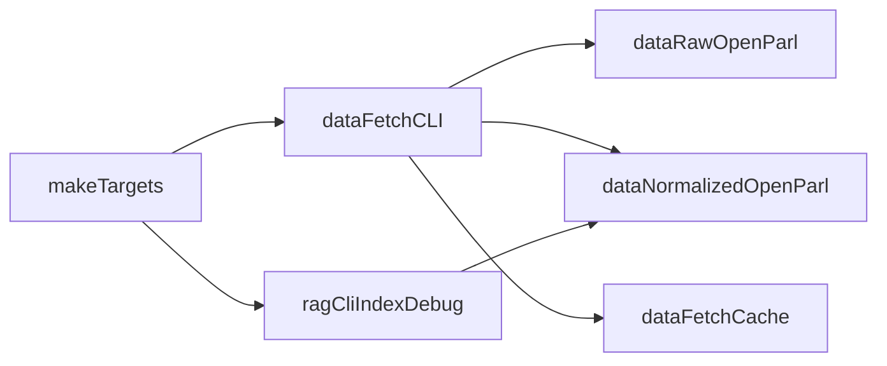

# PLAN-20260314-migration-data-fetch-data-paths

## Contexte

Le repository contient encore un chemin de migration partielle:
- une CLI legacy `fetch-fixtures` encore présente;
- des chemins par défaut `tests/fixtures/...` alors que le flux actif est `data-fetch`;
- des références legacy dans la configuration, l'automatisation et la documentation.

Objectif: finaliser la bascule vers un flux unique `data-fetch` + stockage sous `data/`.

## Objectifs

- Retirer `fetch-fixtures` (code + build + références actives).
- Migrer les chemins `tests/fixtures/...` vers `data/...`.
- Supprimer les paramètres et variables legacy associés.
- Aligner `Makefile`, `README.md` et la documentation de collecte.
- Conserver `docs/fixtures.md` comme page de transition (nom historique, contenu à jour).

## Décisions principales

- Commande officielle de collecte: `backend/cmd/data-fetch`.
- Chemins canoniques:
  - `data/raw/openparldata/`
  - `data/normalized/openparldata/`
  - `data/fetch-cache/openparldata/`
- Plus de fallback `FETCH_FIXTURES_*` dans le code runtime.
- `docs/fixtures.md` est conservé temporairement mais réécrit en mode transition.
- Les plans historiques restent en l'état (annotables comme historiques si nécessaire).

## Flux cible



## Arborescence cible

```text
data/
  raw/
    openparldata/
  normalized/
    openparldata/
  fetch-cache/
    openparldata/
```

## Modifications de fichiers prévues

- Backend:
  - `backend/cmd/data-fetch/main.go`
    - migrer les constantes de chemins vers `data/...`;
    - retirer fallback env legacy `FETCH_FIXTURES_*`.
  - `backend/cmd/rag-cli/main.go`
    - changer le corpus par défaut vers `data/normalized` (+ fallback relatif cohérent).
  - `backend/cmd/fetch-fixtures/main.go`
    - suppression du binaire/commande legacy.
  - `backend/Dockerfile`
    - retirer build/copy de `fetch-fixtures`.

- Configuration / automation:
  - `Makefile`
    - help et exemples `CORPUS` vers `data/normalized`;
    - création de dossiers `data/...`;
    - retirer alias/mentions legacy `fixtures-fetch`.
  - `docker-compose.test.yml`
    - aligner volume de fixtures vers `/app/data`.
  - `.env` et `.env.test`
    - supprimer `FETCH_FIXTURES_*`, garder `DATA_FETCH_*`.

- Documentation:
  - `README.md`
    - commandes, chemins et variables alignés `data-fetch` + `data/...`.
  - `docs/fixtures.md`
    - conserver le fichier, mais documenter uniquement le flux cible;
    - ajouter une courte section de migration (`tests/fixtures` -> `data`).

## Contraintes sécurité impactées

- Conserver les garde-fous réseau existants du fetcher:
  - timeout HTTP,
  - limite de taille des réponses,
  - requêtes sérielles + intervalle minimum + jitter,
  - retries bornés avec backoff.
- Ne pas introduire de nouvelles entrées utilisateur non validées.
- Garder la posture privacy-first:
  - pas de stockage de données utilisateur;
  - corpus limité à des données politiques publiques.

## Vérification post-génération (checklist exécutable)

- [ ] `go run ./cmd/data-fetch` génère bien sous `data/raw/...` et `data/normalized/...`.
- [ ] `go run ./cmd/rag-cli index` fonctionne sans `--corpus` explicite avec `data/normalized`.
- [ ] Build backend OK sans `cmd/fetch-fixtures`.
- [ ] `make data-fetch` fonctionne avec les nouveaux chemins.
- [ ] `docker compose -f docker-compose.test.yml ...` fonctionne avec le nouveau volume `/app/data`.
- [ ] Plus d'occurrence active de `tests/fixtures` dans code/runtime/docs opératoires.
- [ ] Plus d'occurrence active de `FETCH_FIXTURES_` dans code/config.
- [ ] README + `docs/fixtures.md` cohérents avec le flux final.
