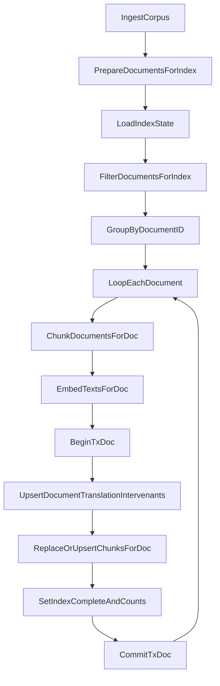

# PLAN-20260314-rag-cli-index-commit-par-document

## Contexte

Le flux actuel de `rag-cli index` construit tous les chunks + embeddings en memoire puis declenche un unique `UpsertChunks(...)` avec une transaction globale, committee en fin de run. En cas d'interruption, la reprise peut etre couteuse et la strategie de skip ne verifie pas explicitement la completude des chunks.

## Objectifs

- Passer d'un commit global a une persistance atomique **par document**.
- Garantir qu'un crash/restart reprend au plus proche du dernier document valide.
- Empecher les faux positifs du skip intelligent si un document est partiellement ecrit.
- Conserver l'idempotence (`ON CONFLICT`) et les contraintes securite/privacy existantes.

## Decisions principales

- Orchestration d'indexation par `DocumentID` dans `[backend/cmd/rag-cli/main.go](backend/cmd/rag-cli/main.go)`:
  - decouper le pipeline en unites document (ou groupe de variantes langue d'un meme document),
  - chunker/embeder/upsert/commit document par document.
- Ecriture DB atomique par document dans `[backend/internal/rag/store.go](backend/internal/rag/store.go)`:
  - transaction dediee par document,
  - marquage explicite de completude d'indexation.
- Renforcement du skip intelligent dans `[backend/internal/rag/index_skip.go](backend/internal/rag/index_skip.go)`:
  - skip autorise uniquement si etat "complet" + coherence du nombre de chunks attendu.

## Flux cible

## Arborescence cible

- Pas de nouveau module majeur; evolution incrementale des fichiers existants:
  - `[backend/cmd/rag-cli/main.go](backend/cmd/rag-cli/main.go)`
  - `[backend/internal/rag/store.go](backend/internal/rag/store.go)`
  - `[backend/internal/rag/index_skip.go](backend/internal/rag/index_skip.go)`
  - tests associes dans `[backend/internal/rag/index_skip_test.go](backend/internal/rag/index_skip_test.go)` et nouveaux tests store/index CLI si necessaires.

## Modifications de fichiers prevues

- `[docs/plans/PLAN-20260314-rag-cli-index-commit-par-document.md](docs/plans/PLAN-20260314-rag-cli-index-commit-par-document.md)`
  - Ajouter ce plan dans le depot (source de verite cote projet) avant demarrage des changements de code.
- `[backend/cmd/rag-cli/main.go](backend/cmd/rag-cli/main.go)`
  - Refactor `runIndex` pour executer le pipeline par document:
    - grouper les `documentsToProcess` par `doc.ID`,
    - chunk/embedding par groupe,
    - appeler un upsert document-scope,
    - logging de progression par document (`processed/total`, duree, chunks).
- `[backend/internal/rag/store.go](backend/internal/rag/store.go)`
  - Introduire un chemin d'upsert **par document** avec transaction dediee.
  - Ajouter un etat de completude index document:
    - `index_complete BOOLEAN NOT NULL DEFAULT false`,
    - `indexed_chunk_count INT NOT NULL DEFAULT 0`,
    - optionnel `index_completed_at TIMESTAMPTZ` pour audit.
  - Assurer la coherence du remplacement de chunks d'un document dans la meme transaction (eviter etat mixte ancien/nouveau).
  - Etendre `LoadIndexState` pour charger les nouveaux champs de completude.
- `[backend/internal/rag/index_skip.go](backend/internal/rag/index_skip.go)`
  - Etendre les criteres `shouldSkipDocumentGroup`:
    - verifier `index_complete=true`,
    - verifier `indexed_chunk_count == expectedChunkCount` (calcul attendu pour le document entrant),
    - puis conserver logique actuelle fingerprint/hash + translations ready.
- `[backend/internal/rag/index_skip_test.go](backend/internal/rag/index_skip_test.go)`
  - Ajouter cas de tests:
    - hash/fingerprint ok mais `index_complete=false` => **ne pas skip**,
    - `index_complete=true` mais count mismatch => **ne pas skip**,
    - etat complet et counts alignes => **skip**.
- (si impact API store) tests/stubs store dans les tests RAG existants.

## Contraintes securite et robustesse

- Aucune journalisation de contenu sensible; logs techniques uniquement (durees, compteurs, IDs techniques).
- Pas de fallback implicite local/llm modifie; conserver la selection de mode explicite.
- Transactions plus courtes pour limiter blast radius en cas d'erreur.
- Idempotence conservee via `ON CONFLICT` et reprises sures apres crash.

## Verification post-generation

- [ ] `go test ./backend/internal/rag/...` passe.
- [ ] `go test ./backend/cmd/rag-cli/...` (ou package couvrant `runIndex`) passe.
- [ ] Run interruption simulee au milieu: redemarrage reprend sans retraiter les documents deja `index_complete=true`.
- [ ] Aucun document partiellement ecrit n'est "skippe" au run suivant.
- [ ] Les resultats de recherche restent coherents (pas de perte/duplication de chunks apres reindex d'un document).
- [ ] Les logs `rag-cli index task=*` montrent progression document par document.
- [ ] Documentation rapide du comportement de reprise ajoutee dans le README RAG (si necessaire).

## Risques et mitigation

- Risque perf (beaucoup de petites transactions): introduire un mode batch optionnel ulterieur si necessaire, sans casser l'atomicite par document.
- Risque de regression skip: couvrir par tests unitaires cibles + scenario crash/reprise en test d'integration.
- Risque de migration schema: garder `ALTER TABLE ... IF NOT EXISTS` compatible retro.
