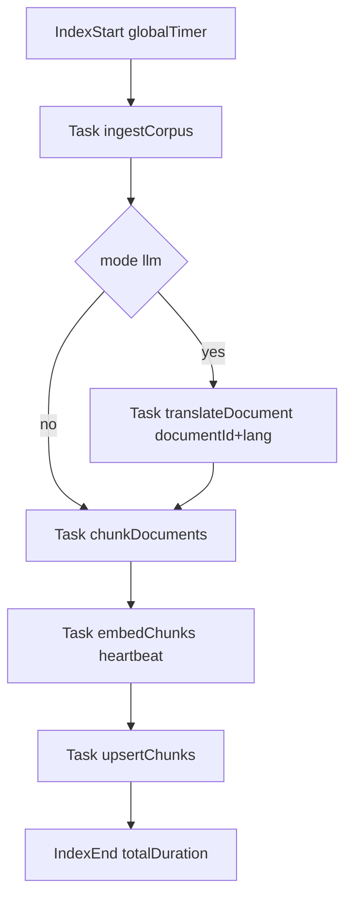

# Plan d’implémentation: logging précis pour `rag-cli index`

## Contexte

Le flux `index` de RAG loggue déjà des étapes globales (traduction/embeddings), mais manque de granularité opérationnelle pour le suivi backend (heuristique ou manuel):

- pas d’identification explicite du document en cours,
- pas d’indication systématique de la langue cible en traduction,
- pas de durée normalisée pour chaque sous-tâche,
- pas de chronométrage global unifié de l’indexation.

Le pipeline concerné passe principalement par [`backend/cmd/rag-cli/main.go`](backend/cmd/rag-cli/main.go), [`backend/internal/rag/ingest.go`](backend/internal/rag/ingest.go) et [`backend/internal/rag/translate.go`](backend/internal/rag/translate.go).

## Objectifs

- Ajouter des logs de progression orientés "tâche" avec contexte minimal utile: `task`, `document_id`, `source_path`, `lang`.
- Mesurer et afficher `elapsed` pour chaque tâche clé et pour la commande `index` complète.
- Garder des logs sûrs: pas de contenu document, pas de prompt, pas de secret/token.
- Conserver un comportement explicite `local` vs `llm` (aucun fallback silencieux).

## Décisions principales

- Introduire un petit helper de chronométrage côté CLI (dans [`backend/cmd/rag-cli/main.go`](backend/cmd/rag-cli/main.go)) pour standardiser `start/end/error + duration_ms`.
- Instrumenter d’abord le niveau orchestration (`runIndex`), puis la granularité document/langue dans [`backend/internal/rag/translate.go`](backend/internal/rag/translate.go).
- Éviter le bruit excessif en ingestion: logs par document uniquement pour les étapes coûteuses (traduction), et logs de synthèse pour ingestion/chunking/upsert.
- Respect sécurité/privacy projet:
  - jamais de texte traduit/source dans les logs,
  - uniquement identifiants techniques (document/langue/statut/durée),
  - erreurs explicites sans données sensibles.

## Flux de logs cible

## Arborescence cible

- [`docs/plans/PLAN-20260314-rag-cli-index-logging.md`](docs/plans/PLAN-20260314-rag-cli-index-logging.md)
- [`backend/cmd/rag-cli/main.go`](backend/cmd/rag-cli/main.go)
- [`backend/internal/rag/translate.go`](backend/internal/rag/translate.go)
- (optionnel selon granularité retenue) [`backend/internal/rag/ingest.go`](backend/internal/rag/ingest.go)

## Modifications de fichiers prévues

- Créer/mettre à jour le plan de travail dans [`docs/plans/PLAN-20260314-rag-cli-index-logging.md`](docs/plans/PLAN-20260314-rag-cli-index-logging.md) avant toute modification substantielle.
- Ajouter un helper local de logging de tâches dans `runIndex`:
  - `task start` (nom tâche + contexte),
  - `task done` (nom tâche + `duration_ms` + compteurs),
  - `task failed` (nom tâche + `duration_ms` + erreur).
- Envelopper avec ce helper les tâches principales:
  - ingestion,
  - traduction globale (si `llm`),
  - chunking,
  - embeddings,
  - upsert DB,
  - total index.
- Dans [`backend/internal/rag/translate.go`](backend/internal/rag/translate.go), ajouter des logs ciblés autour de `translateDocument`:
  - document courant (`document_id`),
  - `source_lang` et `target_lang`,
  - durée par traduction de document,
  - statut (`ready`/`failed`) sans contenu textuel.
- Ajouter une sortie finale enrichie dans la CLI avec durée globale et compteurs utiles (docs/chunks/langues traitées).

## Vérification post-génération

- [ ] Les logs affichent clairement la tâche active et, en traduction, le couple `source_lang -> target_lang`.
- [ ] Chaque tâche clé de `index` expose une durée (`duration_ms`) cohérente.
- [ ] Une durée totale d’indexation est loggée en fin d’exécution.
- [ ] Aucun log ne contient contenu document, prompt LLM, clé API, ni donnée sensible.
- [ ] En mode `local`, aucune étape de traduction LLM n’est exécutée/loggée comme active.
- [ ] Tests manuels CLI réalisés sur corpus de fixture avec vérification des logs d’erreur et de succès.
