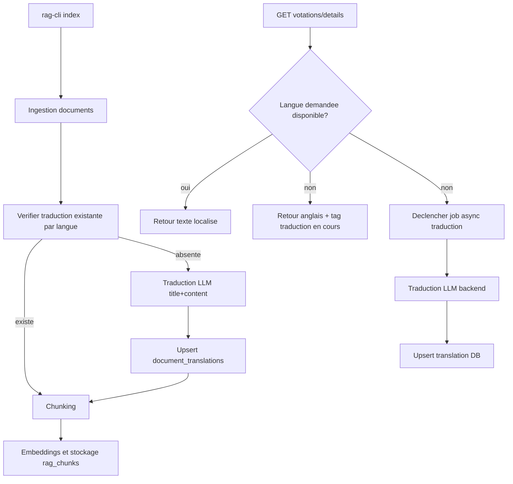

# Plan d’implémentation: traductions RAG à l’indexation

## Contexte

Le pipeline actuel indexe des traductions déjà présentes dans les sources, mais ne traduit pas automatiquement les langues manquantes. L’objectif est de:

- traduire **intitulé + contenu** lors de `rag-cli index` si absents,
- éviter les appels LLM à chaque chargement,
- gérer les futures langues via un fallback asynchrone (`anglais + tag "traduction en cours"`) puis persistance DB.

## Objectifs

- Préremplir `document_translations` pour les langues supportées pendant l’indexation.
- Conserver une architecture explicite `local` vs `llm` (sans fallback silencieux).
- Permettre l’ajout de nouvelles langues via configuration, sans migration DB obligatoire.
- Exposer un statut de traduction pour piloter l’UI et le traitement asynchrone.

## Décisions principales

- **Pas de migration obligatoire**: utiliser `document_translations` existante (`title`, `content_normalized`, `metadata`) et `rag_chunks` existante.
- **Langues dynamiques**: remplacer les listes hardcodées par une source de vérité configurable (env), avec défaut actuel `fr,de,it,rm,en`.
- **Pré-traduction à l’indexation**:
  - Si la langue existe déjà dans les documents source, la réutiliser.
  - Sinon, traduire via service LLM backend (mode explicite), puis upsert DB et chunking normal.
- **Fallback runtime asynchrone**:
  - Si langue absente à la lecture, renvoyer fallback anglais + indicateur `translation_status="pending"`.
  - Déclencher un job backend asynchrone de traduction, upsert DB, disponibilité au prochain refresh.
- **Conformité sécurité**: timeouts réseau, limite de taille prompt, logs sans données sensibles, pas de secrets en dur, erreurs explicites si `llm` mal configuré.

## Flux cible

## Arborescence cible

- `backend/cmd/rag-cli/main.go`
- `backend/cmd/civika-api/main.go`
- `backend/config/config.go`
- `backend/internal/langs/langs.go`
- `backend/internal/rag/translate.go`
- `backend/internal/rag/ingest.go`
- `backend/internal/rag/store.go`
- `backend/internal/services/sql_query_service.go`
- `frontend/src/lib/votations.ts`
- `frontend/src/types/api.ts`

## Modifications de fichiers prévues

- Créer un service de traduction réutilisable (interface + impl LLM + mode désactivé local) pour `title` et `content_normalized`.
- Introduire une config centralisée des langues supportées (index + runtime), extensible et validée.
- Étendre l’ingestion/indexation pour compléter les traductions manquantes avant chunking.
- Ajouter des métadonnées de statut traduction (`ready`, `pending`, `failed`, `translation_source_hash`, `translation_source_lang`, `translation_updated_at`) dans `document_translations.metadata`.
- Adapter les endpoints liste/détail pour renvoyer fallback anglais + statut quand langue absente.
- Ajouter un déclencheur async backend idempotent (anti-doublon `document_id + lang`) pour remplir la traduction manquante.
- Mettre à jour le frontend pour afficher un badge `traduction en cours` quand fallback actif et relancer un refresh.
- Documenter configuration, mode, réindexation et comportement fallback dans README.

## Vérification post-génération

- [ ] `rag-cli index` en mode `llm` traduit les langues manquantes (title + content) et persiste en DB.
- [ ] En mode `local`, aucun fallback silencieux vers LLM n’est effectué.
- [ ] Requête API avec langue absente: fallback anglais + statut `pending`.
- [ ] Après traitement async, la même requête renvoie la langue demandée.
- [ ] Tests unitaires: normalisation langues, détection absence, statut metadata, déduplication jobs, gestion erreurs LLM/timeout.
- [ ] Tests intégration: endpoints clés + cas d’erreur + non-régression sécurité/logging.
