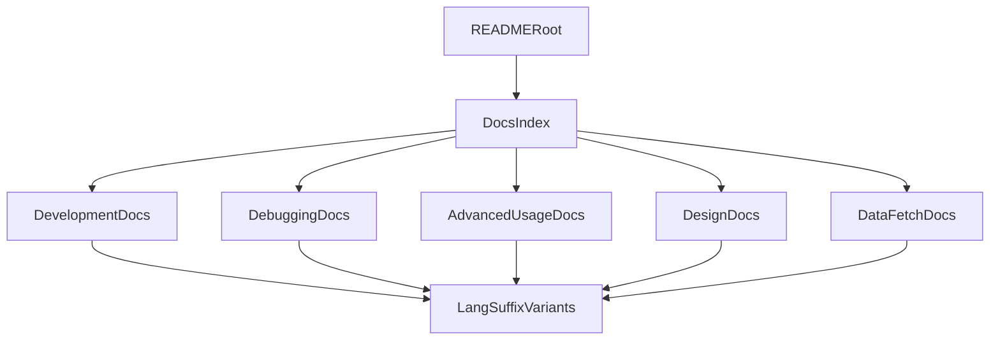

# Plan refonte documentation multilingue

## Contexte
- La documentation est aujourd'hui majoritairement monobloc dans `README.md`, avec un complement dans `docs/data-fetch.md`.
- Le projet a besoin d'un `README` racine standard (presentation rapide + orientation), et d'une documentation detaillee dans `docs/`.
- La convention multilingue retenue est basee sur des suffixes de langue: `.en`, `.it`, `.de`, `.rm`.

## Objectifs
- Reduire `README.md` a un point d'entree clair.
- Deplacer les contenus contextuels vers des documents thematiques dans `docs/`.
- Fournir les traductions EN/IT/DE/RM pour:
  - `README`,
  - `docs/data-fetch`,
  - tous les nouveaux documents crees pendant la refonte.
- Assurer une redaction FR propre et une terminologie coherente entre langues.

## Decisions principales
- Conserver `README.md` comme page d'accueil projet.
- Creer `docs/README.md` comme index central de la documentation.
- Segmenter les contenus en quatre volets:
  - developpement (`docs/development.md`),
  - debugging (`docs/debugging.md`),
  - usage avance (`docs/advanced-usage.md`),
  - design (`docs/design.md`).
- Maintenir `docs/data-fetch.md` en document specialise, harmonise et relie au reste.

## Arborescence cible
- `README.md` + `README.en.md` + `README.it.md` + `README.de.md` + `README.rm.md`
- `docs/README.md` + `docs/README.en.md` + `docs/README.it.md` + `docs/README.de.md` + `docs/README.rm.md`
- `docs/development.md` + variantes `.en/.it/.de/.rm`
- `docs/debugging.md` + variantes `.en/.it/.de/.rm`
- `docs/advanced-usage.md` + variantes `.en/.it/.de/.rm`
- `docs/design.md` + variantes `.en/.it/.de/.rm`
- `docs/data-fetch.md` + variantes `.en/.it/.de/.rm`

## Flux documentaire cible

## Securite et privacy dans la documentation
- Rappeler le mode RAG explicite (`local` vs `llm`) sans fallback silencieux.
- Rappeler la reindexation obligatoire en cas de changement de modele/dimensions d'embedding.
- Rappeler l'absence de persistance de donnees utilisateur et l'interdiction du profilage.
- Eviter tout exemple contenant secrets, tokens ou donnees sensibles.

## Modifications de fichiers prevues
- Reecriture de `README.md`.
- Creation de l'index `docs/README.md`.
- Extraction des sections techniques vers:
  - `docs/development.md`,
  - `docs/debugging.md`,
  - `docs/advanced-usage.md`,
  - `docs/design.md`.
- Harmonisation de `docs/data-fetch.md`.
- Creation des fichiers traduits `.en/.it/.de/.rm` pour l'ensemble du perimetre.

## Verification post-generation
- [ ] `README.md` est concis et oriente onboarding.
- [ ] `docs/README.md` indexe les sections et les langues.
- [ ] Les contenus operationnels ne sont plus monobloc dans la racine.
- [ ] Les versions `.en/.it/.de/.rm` existent pour tous les fichiers du perimetre.
- [ ] Les liens internes sont valides et reciproques.
- [ ] Les sections securite/privacy restent presentes et coherentes.
