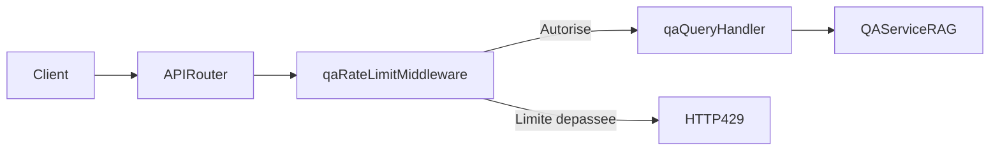

# Plan de remediation securite (Critique + Eleve)

## Contexte
- Source de reference: [docs/audits/20260314.md](docs/audits/20260314.md).
- Perimetre retenu (impact non nul codebase):
  - `CIV-SEC-001` (Critique): dependance `next` vulnerable.
  - `CIV-SEC-002` (Eleve): vulnerabilites stdlib Go detectees par `govulncheck`.
  - `CIV-SEC-003` (Eleve): absence de rate limiting sur `POST /api/v1/qa/query`.
- Contraintes projet relues et appliquees: securite-by-default, validation stricte, logs non sensibles, backend stateless cote utilisateur, tests obligatoires.

## Objectifs
- Corriger les 3 findings prioritaires sans elargir inutilement le scope.
- Ajouter des garde-fous CI pour eviter la reintroduction de composants vulnerables.
- Mettre a jour les tests backend (et validations pipeline) pour garantir l'absence de regression.

## Decisions principales
- Dependances frontend (`CIV-SEC-001`): upgrade controle de `next` et alignement de `eslint-config-next` dans [frontend/package.json](frontend/package.json), avec lockfile mis a jour.
- Toolchain Go (`CIV-SEC-002`): upgrade version Go dans [backend/go.mod](backend/go.mod), puis validation par `govulncheck` dans CI.
- DoS endpoint QA (`CIV-SEC-003`): ajout d'un rate limiting cible route-level sur `/api/v1/qa/query` dans [backend/internal/http/router.go](backend/internal/http/router.go), pilote par configuration.
- Tests anti-regression: prioriser tests HTTP backend existants ([backend/internal/http/handlers_test.go](backend/internal/http/handlers_test.go), [backend/internal/http/router_test.go](backend/internal/http/router_test.go)) + tests config ([backend/config/config_test.go](backend/config/config_test.go)).

## Architecture/flux cible (protection QA)

## Arborescence cible
- Pas de refonte structurelle.
- Ajouts/evolutions dans:
  - [backend/internal/http/router.go](backend/internal/http/router.go)
  - [backend/internal/http/middleware.go](backend/internal/http/middleware.go) ou nouveau fichier dedie middleware QA
  - [backend/config/config.go](backend/config/config.go)
  - [backend/config/config_test.go](backend/config/config_test.go)
  - [backend/internal/http/handlers_test.go](backend/internal/http/handlers_test.go)
  - [backend/internal/http/router_test.go](backend/internal/http/router_test.go)
  - [frontend/package.json](frontend/package.json)
  - `frontend/package-lock.json`
  - [backend/go.mod](backend/go.mod)
  - [Makefile](Makefile)
  - [.github/workflows/rag-pipeline.yml](.github/workflows/rag-pipeline.yml)
  - [.env.example](.env.example), [.env.test](.env.test), [README.md](README.md)

## Modifications de fichiers prevues
- `CIV-SEC-001` (Next vulnerable):
  - Upgrader `next` vers version corrigee et aligner `eslint-config-next`.
  - Regenerer lockfile et verifier compatibilite lint/typecheck/build.
- `CIV-SEC-002` (stdlib Go vulnerable):
  - Monter la version Go utilisee par le backend.
  - Revalider `go test`, `go vet`, `govulncheck`.
  - Ajouter etape CI dediee `govulncheck`.
- `CIV-SEC-003` (pas de rate limiting QA):
  - Implementer un middleware de limitation de debit en memoire, scope uniquement `POST /api/v1/qa/query`.
  - Exposer parametres via config (`API_QA_RATE_LIMIT_*`) avec valeurs par defaut prudentes pour PoC.
  - Retourner `429` en cas de depassement, sans fuite d'info sensible.

## Plan de tests et non-regression
- Tests backend a ajouter/adapter:
  - Cas autorise sous limite, depassement -> `429`, verification que routes non QA ne sont pas affectees.
  - Tests de chargement config pour nouveaux parametres de rate limiting.
- Validation frontend apres upgrade Next:
  - `npm run lint`
  - `npx tsc --noEmit`
  - `npm run build`
- Validation backend securite/qualite:
  - `go test ./...`
  - `go vet ./...`
  - `go run golang.org/x/vuln/cmd/govulncheck@latest ./...`
- Validation CI:
  - Ajouter des jobs/checks securite reproductibles (frontend audit + backend vulncheck) dans [.github/workflows/rag-pipeline.yml](.github/workflows/rag-pipeline.yml) ou workflow securite dedie.

## Verification post-generation (checklist)
- [ ] `CIV-SEC-001`: `npm audit --omit=dev` ne remonte plus de critique sur `next`.
- [ ] `CIV-SEC-002`: `govulncheck` ne signale plus de vulnerabilite atteignable liee au toolchain corrige.
- [ ] `CIV-SEC-003`: `POST /api/v1/qa/query` repond `429` au-dela du quota, sans impact sur `/health` et autres endpoints.
- [ ] Les tests ajoutes passent en local et en CI.
- [ ] Documentation mise a jour (variables env, strategie securite, reference explicite a l'audit [docs/audits/20260314.md](docs/audits/20260314.md)).

## Contraintes securite impactees
- Validation stricte et fail-closed sur endpoint couteux.
- Reduction surface d'attaque composants tiers et runtime.
- Absence de persistance de donnees utilisateur pour le rate limiting (memoire volatile).
- Journalisation minimale, sans donnees sensibles.
