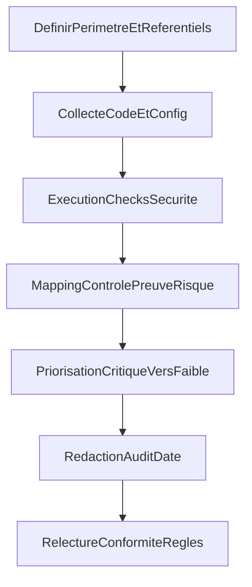

# Plan d'audit securite Civika

## Contexte

Civika est un PoC public backend Go + frontend TypeScript/Next.js avec priorite securite et privacy-first.  
L'objectif est de produire un audit securite complet, transparent et priorise, sans appliquer de correctifs dans cette phase.

## Objectifs

- Produire un audit documente dans `docs/audits/20260314.md`.
- Classer les constats par criticite decroissante (`Critique`, `Eleve`, `Moyen`, `Faible`).
- Appuyer les constats sur des preuves techniques (code, configuration, execution de checks).
- Mapper les constats a des standards reconnus (OWASP, Go officiel, TypeScript officiel).

## Decisions principales

- Perimetre: backend, frontend, infra locale et configuration runtime.
- Methodologie: revue statique + verifications outillees non destructives.
- References: OWASP ASVS 5.0, OWASP Top 10, OWASP REST/Input Validation Cheat Sheets, Go security best practices, TypeScript strict mode.
- Le livrable d'audit contient uniquement analyse, risques et recommandations; aucun patch applicatif.

## Arborescence cible

- `docs/plans/PLAN-20260314-security-audit.md`
- `docs/audits/20260314.md`
- Sources inspectees (non exhaustif):
  - `backend/cmd/civika-api/main.go`
  - `backend/internal/http/*`
  - `backend/internal/security/http_security.go`
  - `backend/config/config.go`
  - `backend/internal/services/*`
  - `backend/internal/rag/*`
  - `frontend/src/lib/api.ts`
  - `frontend/src/components/qa/*`
  - `frontend/src/app/*`
  - `frontend/next.config.ts`
  - `README.md`, `.env.example`, `.env.test`, `docker-compose.yml`

## Modifications de fichiers prevues

- Creer ce plan dans `docs/plans`.
- Creer `docs/audits/20260314.md` avec:
  - contexte et methodologie,
  - referentiels de controle,
  - findings tries par severite decroissante,
  - table de tracabilite finding -> preuve -> controle,
  - points positifs, limites, recommandations priorisees.

## Flux de production

## Verification post-generation

- [ ] Le plan est present dans `docs/plans`.
- [ ] L'audit est present dans `docs/audits/20260314.md`.
- [ ] Les findings sont tries par criticite decroissante.
- [ ] Chaque finding contient une preuve concrete et traçable.
- [ ] Les references OWASP/Go/TypeScript sont explicites.
- [ ] Le rapport ne contient pas de correctifs implementes.
- [ ] Le rapport respecte les contraintes privacy (pas de donnees personnelles ni secrets).
