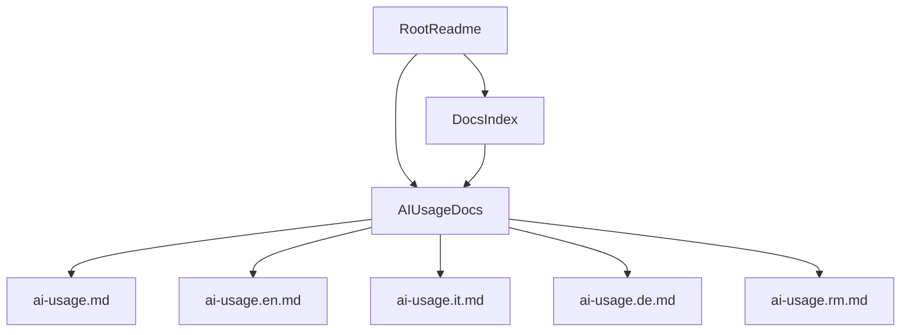

# Plan transparence usage IA

## Contexte
- Le projet est multilingue avec un `README` racine par langue et un espace documentaire dedie sous `docs/`.
- Une information de transparence est necessaire: une partie importante du code a ete produite avec assistance IA, sous supervision humaine.
- La visibilite doit etre immediate pour les nouveaux lecteurs, sans alourdir le point d'entree.

## Objectifs
- Exposer clairement l'usage de l'IA dans le projet.
- Conserver un `README` racine concis et oriente onboarding.
- Centraliser les details dans une page dediee sous `docs/`, avec versions linguistiques.
- Garantir une terminologie coherente entre FR/EN/IT/DE/RM.

## Decisions principales
- Adopter une approche hybride:
  - mention courte dans chaque `README` racine,
  - details complets dans `docs/ai-usage*.md`.
- Ajouter un lien vers la page dediee dans les index `docs/README*.md`.
- Declarer explicitement:
  - generation assistee par IA sous supervision humaine,
  - tests et validation manuels,
  - sessions de debugging assistees par IA.

## Arborescence cible
- `docs/ai-usage.md`
- `docs/ai-usage.en.md`
- `docs/ai-usage.it.md`
- `docs/ai-usage.de.md`
- `docs/ai-usage.rm.md`
- Mise a jour de:
  - `README.md`, `README.en.md`, `README.it.md`, `README.de.md`, `README.rm.md`
  - `docs/README.md`, `docs/README.en.md`, `docs/README.it.md`, `docs/README.de.md`, `docs/README.rm.md`

## Flux documentaire cible

## Contraintes securite et privacy
- Ne pas exposer de donnees personnelles dans la documentation sur l'IA.
- Rappeler que la responsabilite finale de validation reste humaine.
- Eviter toute formulation qui pourrait suggerer une automatisation non verifiee.

## Modifications de fichiers prevues
- Ajout des pages `docs/ai-usage*.md`.
- Ajout d'une section breve "Usage de l'IA" dans chaque `README` racine.
- Ajout du lien "Usage de l'IA" dans chaque index `docs/README*.md`.

## Verification post-generation
- [ ] Les 5 README racines mentionnent l'usage de l'IA et pointent vers la page dediee.
- [ ] Les 5 index `docs/README*.md` referencent la page `ai-usage`.
- [ ] Les 5 versions linguistiques de `ai-usage` existent.
- [ ] Le contenu mentionne supervision humaine, tests manuels, validation manuelle, debugging assiste IA.
- [ ] Le vocabulaire reste coherent entre langues.
