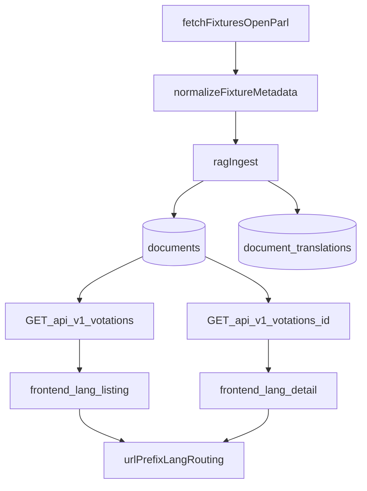

# Plan d'implementation: intitules + localisation + i18n

## Contexte
- Le frontend affiche deja les votations via `frontend/src/app/page.tsx`, `frontend/src/components/votations/VotationList.tsx` et `frontend/src/app/votations/[id]/page.tsx`.
- Le backend retourne `titles`, `level`, `canton` via `backend/internal/services/sql_query_service.go` et accepte `lang` sur le listing.
- Des fixtures OpenParlData contiennent des `voting.title` generiques (`Abstimmung`) alors que l'intitule metier est dans `affair_title`/`affair.title`.

## Objectifs
- Afficher un intitule metier dans listing + detail.
- Afficher le canton pour les votations cantonales et preparer la commune pour les votations communales.
- Mettre en place une i18n frontend solide (fr, de, it, rm, en), extensible.
- Corriger les textes francais (accents, formulations) et sortir les libelles dans des dictionnaires.
- Simplifier l'acces DB/API aux champs intitule, canton, commune.

## Decisions principales
- Routage i18n par prefixe d'URL: `/{lang}/...`.
- Priorite de titre: `affair_title`/`affair.title` > `voting.title` > fallback localise.
- Ajout des champs communaux des maintenant dans la couche donnees/API.
- Langues supportees pilotees par config frontend, extensibles.

## Flux cible

## Fichiers cibles
- Frontend:
  - `frontend/src/app/[lang]/page.tsx`
  - `frontend/src/app/[lang]/votations/[id]/page.tsx`
  - `frontend/src/lib/i18n/config.ts`
  - `frontend/src/lib/i18n/messages.ts`
  - `frontend/src/lib/api.ts`
  - `frontend/src/components/votations/VotationList.tsx`
- Backend/API:
  - `backend/internal/services/api_models.go`
  - `backend/internal/services/sql_query_service.go`
  - `backend/internal/http/handlers.go`
- Ingestion/fixtures:
  - `backend/internal/rag/ingest.go`
  - `backend/cmd/fetch-fixtures/main.go`
- Schema:
  - `scripts/sql/init_pgvector.sql`
  - `backend/internal/rag/store.go`
- Tests/doc:
  - `backend/internal/http/handlers_test.go`
  - `backend/internal/rag/ingest_test.go`
  - `README.md`

## Verification post-implementation
- `cd backend && go test ./...`
- `cd frontend && pnpm lint`
- `cd frontend && pnpm exec tsc --noEmit`
- `make rag-index`
- Verification visuelle listing + detail en fr/de/it/rm/en
