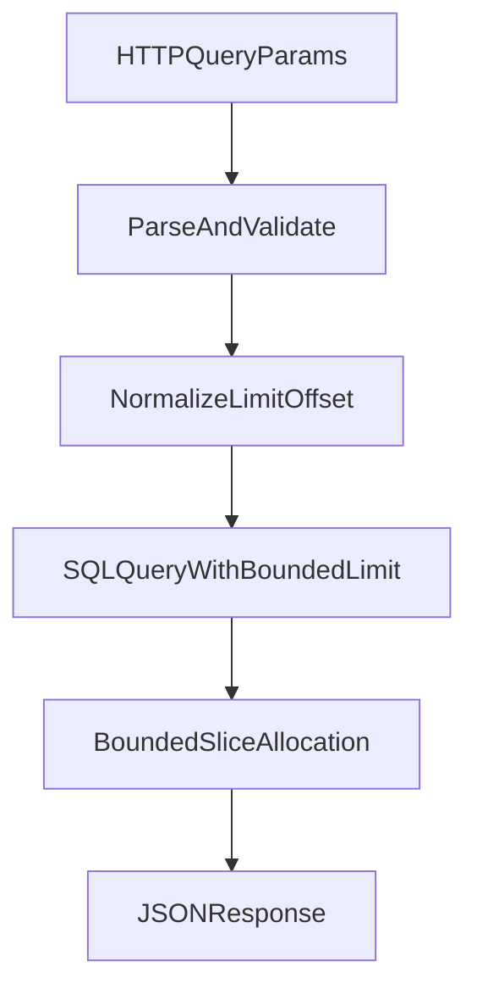

# Plan: remediation CodeQL uncontrolled allocation size

## Contexte

GitHub Code Scanning remonte deux alertes High (`go/uncontrolled-allocation-size`)
dans le meme fichier backend:

- `backend/internal/rag/usage_metrics.go`
- allocations de slices initialisees avec une capacite derivee de `filter.Limit`

Le risque vise est un DoS memoire (CWE-770) via allocation excessive.

## Objectifs

- Corriger les deux alertes dans `backend/internal/rag/usage_metrics.go`.
- Garder une defense en profondeur entre couche HTTP et couche store.
- Ajouter des tests de non-regression sur les bornes de pagination/allocation.
- Ajouter une regle Cursor projet pour eviter la reintroduction du pattern.

## Decisions principales

- Centraliser la normalisation `limit/offset` via des constantes explicites.
- Eviter toute pre-allocation basee directement sur une valeur issue d'entree
  externe, meme bornee.
- Conserver les validations d'entree HTTP existantes et appliquer le meme garde
  en couche store.
- Ajouter des tests unitaires du helper de normalisation.

## Arborescence cible

- `backend/internal/rag/usage_metrics.go`
- `backend/internal/rag/usage_metrics_test.go`
- `.cursor/rules/project.mdc`

## Modifications de fichiers prevues

- `backend/internal/rag/usage_metrics.go`
  - introduire des constantes de bornage (`default`, `max`, `min`).
  - introduire un helper de normalisation reutilisable.
  - remplacer les allocations signalees pour ne plus dependre d'un `limit`
    controle par utilisateur.
- `backend/internal/rag/usage_metrics_test.go`
  - ajouter des tests table-driven sur limites invalides/valides.
- `.cursor/rules/project.mdc`
  - ajouter une section anti-regression pour allocations memoire controlees.

## Flux technique

## Verification post-generation

- [ ] `go test ./backend/internal/rag/...`
- [ ] `go test ./backend/...`
- [ ] verifier qu'aucune allocation `make(..., filter.Limit)` ne subsiste dans
      `backend/internal/rag/usage_metrics.go`
- [ ] verifier les diagnostics lint sur les fichiers modifies
- [ ] pousser la branche et verifier la fermeture des alertes Code Scanning

## Contraintes securite

- Validation explicite des tailles avant usage.
- Bornage strict des valeurs de pagination.
- Pas de fallback silencieux de securite.
