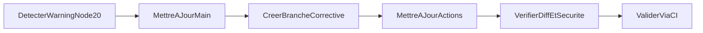

# Plan de correction CI Node.js 20

## Contexte

GitHub Actions remonte un avertissement de deprecation: certaines actions
JavaScript utilisent un runtime Node 20 qui sera force vers Node 24.

Signal: [PR #6 · cjeanneret/Civika@6413e22 · GitHub](https://github.com/cjeanneret/Civika/actions/runs/23108903960/job/67122849856#step:17:2)

Fichiers impactes:
- `.github/workflows/api-contract-tests.yml`
- `.github/workflows/rag-pipeline.yml`

## Objectifs

- Eliminer l'avertissement Node 20 en CI.
- Garder un changement minimal et robuste.
- Conserver les garanties de securite existantes dans les workflows.

## Decisions principales

- Mettre a jour les actions `actions/*` vers des versions compatibles Node 24.
- Ne pas modifier la logique des jobs (steps, permissions, timeouts).
- Limiter le scope aux deux workflows identifies.

## Arborescence cible

- `docs/plans/PLAN-20260315-fix-node-actions-ci.md` (ce document)
- `.github/workflows/api-contract-tests.yml`
- `.github/workflows/rag-pipeline.yml`

## Flux de correction

## Modifications de fichiers prevues

- `.github/workflows/api-contract-tests.yml`
  - `actions/checkout@v4` -> `actions/checkout@v5`
  - `actions/setup-go@v5` -> `actions/setup-go@v6`
  - `actions/setup-python@v5` -> `actions/setup-python@v6`
  - `actions/upload-artifact@v4` -> `actions/upload-artifact@v6`
- `.github/workflows/rag-pipeline.yml`
  - `actions/checkout@v4` -> `actions/checkout@v5` (toutes occurrences)
  - `actions/setup-node@v4` -> `actions/setup-node@v5`
  - `actions/setup-go@v5` -> `actions/setup-go@v6` (toutes occurrences)

## Verification post-generation

- [ ] `main` synchronisee avec `origin/main`.
- [ ] Branche corrective creee depuis `main` a jour.
- [ ] Versions `actions/*` mises a jour dans les 2 workflows cibles.
- [ ] Permissions minimales et cleanup `if: always()` conserves.
- [ ] Diff limite aux changements de versions d'actions.
- [ ] CI relancee sans avertissement Node 20.

## Contraintes securite impactees

- Maintien de `permissions: contents: read`.
- Aucun secret ajoute, aucun logging sensible introduit.
- Reduction du risque de rupture future runner en anticipant Node 24.
