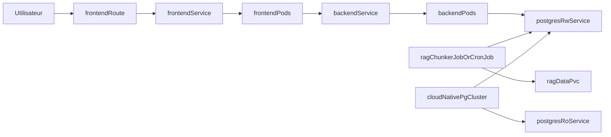

# Plan Helm OpenShift Civika

## Contexte

Civika doit pouvoir etre deployee sur OpenShift avec une configuration
coherente pour:
- frontend web,
- backend API,
- base PostgreSQL avec endpoints RW/RO,
- workloads temporaires d'indexation RAG.

Le projet ne contient pas encore de chart Helm Kubernetes/OpenShift.

## Objectifs

- Ajouter un chart Helm unique sous `deploy/helm/civika`.
- Supporter deux modes PostgreSQL:
  - `managed`: creation du cluster via CloudNativePG,
  - `external`: connexion a un cluster existant.
- Exposer backend et frontend via `Service` (`LoadBalancer` par defaut)
  et `Route` OpenShift optionnelle.
- Ajouter `rag_chunker` en:
  - `Job` manuel parallele,
  - `CronJob` optionnel.
- Garder des garde-fous securite compatibles OpenShift.

## Decisions principales

- Operator choisi: CloudNativePG (`postgresql.cnpg.io/v1`), reconnu et
  activement maintenu.
- Un chart Helm unique avec toggles `values.yaml` pour limiter la
  duplication des manifests.
- Replica par defaut:
  - backend: `1`,
  - frontend: `1`.
- Gestion des secrets via `existingSecret` ou secret genere a partir de
  values, sans hardcode dans les templates.

## Architecture cible

## Arborescence cible

- `deploy/helm/civika/Chart.yaml`
- `deploy/helm/civika/values.yaml`
- `deploy/helm/civika/templates/_helpers.tpl`
- `deploy/helm/civika/templates/backend-deployment.yaml`
- `deploy/helm/civika/templates/backend-service.yaml`
- `deploy/helm/civika/templates/frontend-deployment.yaml`
- `deploy/helm/civika/templates/frontend-service.yaml`
- `deploy/helm/civika/templates/routes.yaml`
- `deploy/helm/civika/templates/postgres-cnpg-cluster.yaml`
- `deploy/helm/civika/templates/rag-chunker-job.yaml`
- `deploy/helm/civika/templates/rag-chunker-cronjob.yaml`
- `deploy/helm/civika/templates/secrets.yaml`
- `deploy/helm/civika/templates/networkpolicy.yaml`

## Modifications de fichiers prevues

- Ajouter le chart Helm complet dans `deploy/helm/civika`.
- Documenter l'usage Helm/OpenShift dans:
  - `README.md` et variantes linguistiques,
  - `docs/advanced-usage.md` et variantes linguistiques.
- Ajouter des exemples de `values` pour:
  - mode PostgreSQL managed/external,
  - `rag_chunker` Job/CronJob.

## Contraintes securite

- Eviter l'execution root dans les pods applicatifs.
- Ne pas exposer de credentials en clair dans les manifests.
- Ajouter des probes (liveness/readiness) sur backend/frontend.
- Limiter les flux reseau avec `NetworkPolicy`.
- Garder la separation stricte entre valeurs sensibles et non sensibles.

## Checklist de verification

- [ ] Branche dediee creee et alignee sur `origin/main`.
- [ ] `helm lint deploy/helm/civika` reussi.
- [ ] `helm template` valide en mode `postgresql.mode=managed`.
- [ ] `helm template` valide en mode `postgresql.mode=external`.
- [ ] Backend et frontend renderes avec 1 replica par defaut.
- [ ] Job `rag_chunker` parallele rendu avec `parallelism/completions`.
- [ ] CronJob `rag_chunker` rendu seulement si active.
- [ ] Documentation Helm/OpenShift mise a jour en plusieurs langues.
