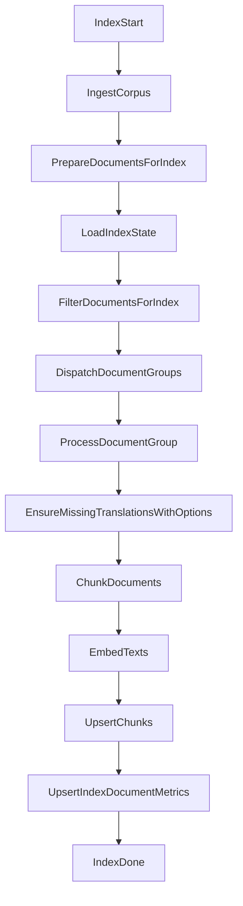

# Plan d'implementation: pipeline d'indexation par document

## Contexte
- Le flux `rag-cli index` execute actuellement une traduction globale en mode `llm`, puis traite les documents pour chunking, embeddings et insertion.
- Cette approche retarde la disponibilite des premiers documents indexes.
- Le projet vise un pipeline plus incremental et preparant la parallelisation sans conflit.

## Objectifs
- Executer le cycle complet par document: traduction -> chunking -> embedding -> insertion -> metriques.
- Conserver les regles de securite actuelles:
  - mode explicite `local|llm` sans fallback silencieux,
  - logs sans contenu sensible,
  - validations strictes des entrees et tailles.
- Introduire un mecanisme de parallelisation controlee, avec comportement par defaut identique (`workers=1`).

## Decisions principales
- Refactoriser `runIndex` dans `backend/cmd/rag-cli/main.go` pour deleguer le traitement d'un groupe documentaire a une fonction dediee.
- Deplacer `EnsureMissingTranslationsWithOptions` dans le traitement par document en mode `llm`.
- Garder `FilterDocumentsForIndex` en amont pour limiter le travail inutile.
- Ajouter un worker pool optionnel (`--workers`) pour paralleliser sans melanger les documents.

## Arborescence cible
- `backend/cmd/rag-cli/main.go` (orchestration et worker pool)
- `backend/cmd/rag-cli/main_test.go` (tests de non-regression pipeline)
- `docs/advanced-usage.md` (documentation indexation progressive)
- `README.md` (note operationnelle indexation)

## Modifications de fichiers prevues
- `backend/cmd/rag-cli/main.go`
  - ajouter `--workers`,
  - extraire `processDocumentGroup`,
  - executer traduction/chunk/embed/upsert/metrics par document,
  - conserver heartbeat et metriques globales.
- `backend/cmd/rag-cli/main_test.go`
  - tester que la traduction est faite par document,
  - tester la propagation d'erreur par document.
- `docs/advanced-usage.md`
  - documenter le pipeline incremental et l'option `--workers`.
- `README.md`
  - ajouter une section courte sur la visibilite progressive des documents.

## Flux technique

## Verification post-generation
- [ ] `rag-cli index` ne fait plus de traduction batch globale.
- [ ] Un document termine est visible en base avant la fin complete du run.
- [ ] `--workers=1` reproduit le comportement serial actuel.
- [ ] En mode `llm`, une config invalide retourne une erreur explicite.
- [ ] Tests Go passent: `cd backend && go test ./cmd/rag-cli`.
