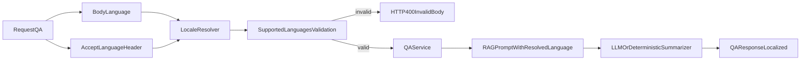

# Plan d'implementation: langue visiteur pour QA LLM

## Contexte
- Le flux QA accepte une langue, mais la synthese LLM etait forcee en francais.
- Objectif: garantir des reponses QA dans la langue du visiteur, de facon stricte et explicite.

## Objectifs
- Imposer la langue de sortie du resume QA via le prompt.
- Standardiser la resolution de langue: `body.language` > `Accept-Language` > defaut.
- Rejeter les langues non supportees avec une erreur `400`.

## Decisions principales
- Validation stricte backend de la langue QA contre la whitelist RAG.
- Canonicalisation des variantes regionales (`de-CH` -> `de`).
- Propagation de la langue resolue jusqu'a la couche RAG/summarizer (LLM et mode local).
- Alignement du contrat OpenAPI et du client frontend (`Accept-Language`).

## Arborescence cible
- `backend/internal/http/handlers.go`: resolution/validation de langue QA.
- `backend/internal/rag/query.go`: prompt avec consigne de langue + deterministe multilingue.
- `backend/internal/services/qa_service.go`: propagation langue resolue + message no-source localise.
- `frontend/src/lib/api.ts`: envoi du header `Accept-Language`.
- `docs/openapi/civika-api-v1.yaml`: contrat langue whitelist + parametre header QA.
- `docs/advanced-usage.md`: documentation du comportement.

## Flux technique

## Modifications de fichiers prevues
- Backend HTTP:
  - Ajouter la resolution de langue QA par priorite.
  - Retourner `invalid_body` si langue invalide/non supportee.
- Backend RAG:
  - Modifier l'interface `Summarizer` pour accepter la langue.
  - Injecter l'instruction de langue dans le prompt.
  - Localiser les messages deterministes.
- Backend services:
  - Propager une seule langue resolue jusqu'a la sortie QA.
- Frontend:
  - Ajouter `Accept-Language` sur les appels API orientes langue.
- Contrat/docs:
  - Mettre a jour OpenAPI et documentation avancee.

## Contraintes securite impactees
- Validation explicite des entrees `language` et `Accept-Language`.
- Aucune exposition de secret/token dans logs et reponses.
- Pas de fallback silencieux vers une langue non declaree.

## Verification post-generation
- [ ] QA retourne `400` pour `language` non supportee (ex: `es`).
- [ ] QA choisit la langue du `body` en priorite sur `Accept-Language`.
- [ ] QA utilise `Accept-Language` quand `body.language` est vide.
- [ ] Le prompt LLM contient la consigne de langue resolue.
- [ ] Les tests backend concernes passent.
