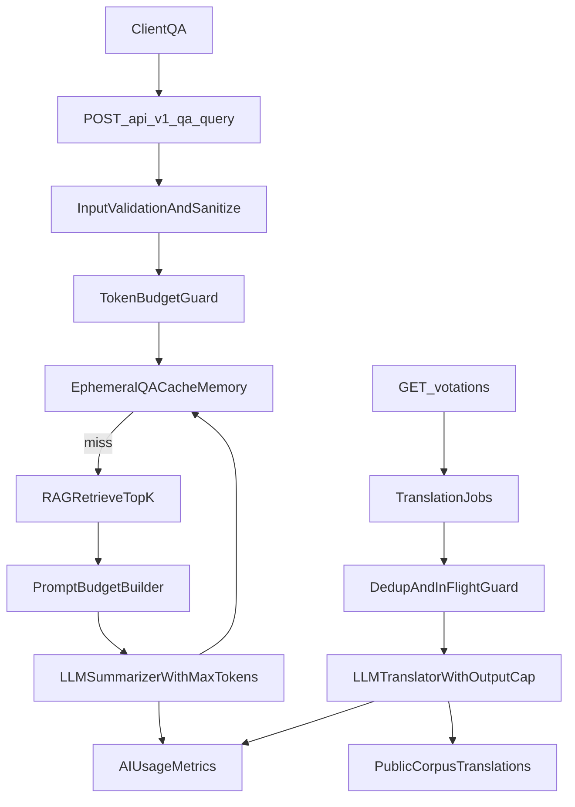

# Audit usage LLM et reduction tokens

## Contexte

Civika utilise un pipeline RAG avec deux modes explicites:
- `RAG_MODE=local`: deterministe, sans appel reseau LLM.
- `RAG_MODE=llm`: embeddings, summarization QA et traduction via API LLM.

Ce document formalise:
- l'audit des surfaces LLM existantes,
- les limites deja en place pour contenir les couts,
- un plan de reduction des requetes/tokens selon best practices,
- un cadrage cache compatible privacy-first.

## Objectifs

- Cartographier ou et comment les appels LLM sont declenches.
- Lister les garde-fous existants (limites, timeouts, sanitization, rate limit).
- Identifier les ecarts priorites cout/tokens/privacy.
- Definir un backlog priorise, implemementable sans regression securite/privacy.

## Decisions principales

- Prioriser les optimisations "token governance" avant toute optimisation avancee.
- Appliquer une separation stricte entre:
  - cache persistant d'artefacts publics (autorise),
  - cache QA utilisateur durable (interdit).
- Garder la selection de mode RAG explicite (`local`/`llm`) sans fallback silencieux.
- Ne jamais stocker prompts/reponses QA utilisateur en persistance serveur.

## Arborescence cible

- `docs/plans/PLAN-20260315-llm-usage-audit-and-token-reduction.md` (ce document)

## Cartographie des usages LLM

### Appels LLM directs (runtime backend)

- `backend/internal/rag/embed.go`
  - `LLMEmbedder.EmbedTexts` -> `POST /v1/embeddings`
- `backend/internal/rag/query.go`
  - `LLMSummarizer.Summarize` -> `POST /v1/chat/completions`
- `backend/internal/rag/translate.go`
  - `LLMTranslator.Translate/translateOnce` -> `POST /v1/chat/completions`

### Appels LLM indirects (via services/endpoints)

- QA:
  - endpoint `POST /api/v1/qa/query`
  - flux: `handlers.go` -> `qa_service.go` -> `rag.QueryRAG` (embedding) + `rag.ExplainVotation` (summarization)
- Traduction votations:
  - endpoints `GET /api/v1/votations` et `GET /api/v1/votations/{id}`
  - flux: `sql_query_service.go` -> fallback traduction asynchrone -> `LLMTranslator`
- CLI RAG:
  - `backend/cmd/rag-cli/main.go` (`index`, `query`) en mode `RAG_MODE=llm`

### Cablage et configuration

- Validation mode: `backend/config/config.go` (`ValidateRAGMode`)
- Runtime API: `backend/cmd/civika-api/main.go`
- Runtime CLI: `backend/cmd/rag-cli/main.go`
- Variables principales: `.env.example`, `docs/advanced-usage.md`

## Limites existantes pour reduire la consommation

### Garde-fous applicatifs

- Rate limit QA:
  - `API_QA_RATE_LIMIT_QPS` (defaut `1`)
  - `API_QA_RATE_LIMIT_BURST` (defaut `3`)
  - middleware sur `POST /api/v1/qa/query`
- Validation longueur question:
  - rejet HTTP si `question > 2000` chars
  - sanitation service: troncature a `1200` chars + redaction email/telephone
- Limites prompt/input:
  - `LLM_MAX_PROMPT_CHARS` (defaut `4000`) sur summarization
  - `LLM_EMBEDDING_MAX_INPUT_CHARS` (defaut `4000`) sur embeddings
- Timeouts:
  - `LLM_TIMEOUT` (defaut `10s`)
  - `LLM_TRANSLATION_TIMEOUT` (defaut code `10s`, exemple env `120s`)
  - `LLM_EMBEDDING_TIMEOUT` (defaut `10s`)
- Taille de reponse lue:
  - `io.LimitReader(..., 2*1024*1024)` sur chat/embeddings/traduction
- Reutilisation existante:
  - reuse de traductions deja prêtes via hash source
  - skip indexation intelligente via fingerprint documents
- Observabilite:
  - metriques `ai_usage_events`, `ai_usage_daily_agg`, `rag_index_document_metrics`
  - endpoint `GET /api/v1/metrics/ai-usage`

### Ecarts et faiblesses identifies

- Pas de borne explicite de sortie LLM (`max_tokens`) dans payload chat.
- Controle majoritairement en caracteres, pas en tokens modele.
- Retry traduction:
  - present et configure en CLI (`LLM_TRANSLATION_MAX_RETRIES`),
  - non cable dans runtime API (`buildTranslatorRuntime`) -> perte de robustesse.
- Pas de budget hard/soft de consommation par periode.
- Pas de cache QA privacy-safe explicite.
- Log debug traduction peut inclure `response_preview` (risque exposition contenu).

## Flux technique cible (reduction tokens/requetes)

## Propositions best practices (priorisees)

## Phase 1 - Quick wins (faible risque, impact rapide)

1. Ajouter une borne de sortie LLM explicite
- Ajouter config:
  - `LLM_MAX_OUTPUT_TOKENS_SUMMARIZATION`
  - `LLM_MAX_OUTPUT_TOKENS_TRANSLATION`
- Injecter ces bornes dans payloads chat (`max_tokens` ou equivalent provider).
- Benefice: reduction immediate des sorties longues et du cout.

2. Renforcer les contraintes de prompt de sortie
- Summarization: instruction explicite "1 a 2 phrases, max N mots, style factuel".
- Traduction: reaffirmer "texte seul, sans commentaire" + cap output tokens.
- Benefice: reduction output tokens et variance.

3. Budget de contexte par requete QA
- Limiter le contexte injecte par:
  - top-k dynamique selon budget tokens,
  - troncature snippets par source,
  - arret des ajouts quand budget atteint.
- Benefice: baisse input tokens avec impact faible sur precision si calibrage.

4. Corriger le cablage retries traduction cote API
- Passer `TranslationMaxRetries` a `LLMTranslatorConfig` dans `backend/cmd/civika-api/main.go`.
- Benefice: moins d'echecs "bruit", reduction des relances manuelles couteuses.

5. Supprimer `response_preview` des logs debug traduction
- Conserver uniquement metadonnees techniques (taille, status, duree, code erreur).
- Benefice: alignement privacy et reduction risque fuite contenu.

## Phase 2 - Reduction structurelle (moyen terme)

1. Token accounting pre-appel
- Estimer tokens avant appel (approximation conservative).
- Refuser/adapter requete si depassement budget input.

2. Budget journalier soft/hard
- Seuil soft: alerte + degradation controlee.
- Seuil hard: blocage explicite des appels LLM (pas de fallback implicite).
- Pilotage via config et metriques existantes.

3. Cache QA memoire ephemere (privacy-safe)
- TTL court (ex: 2-10 min), LRU, taille max stricte.
- Cle hash non reversible, derivee de:
  - question sanitizee,
  - ids des documents sources utilises,
  - mode/provider/model/prompt_version.
- Pas de persistance disque/DB.

4. Batching embeddings borne
- Introduire `LLM_EMBEDDING_MAX_BATCH_ITEMS`.
- Decouper les gros lots d'indexation.
- Benefice: requetes plus stables et moins de retries couteux.

## Phase 3 - Optimisations avancees (optionnelles)

1. Cache semantique QA prudent
- Seulement si signal qualite suffisant et sans stockage durable de contenu utilisateur.
- Requiert garde-fous stricts anti-mauvaise reponse contextuelle.

2. Routing modele par complexite
- Modele plus petit par defaut, plus grand sur cas complexes.
- A implementer seulement avec metriques de qualite etablies.

## Regles cache privacy-first (obligatoires)

### Autorise

- Persistant:
  - traductions de corpus public officiel,
  - embeddings de corpus public,
  - metadonnees techniques anonymes d'usage.
- Ephemere memoire:
  - reponses QA transitoires non reliees a une identite.

### Interdit

- Stockage durable de:
  - question utilisateur brute,
  - prompt complet,
  - reponse QA brute,
  - IP, user-agent correlable, identifiant utilisateur.
- Tables de profilage utilisateur (`users`, `profiles`, `sessions`, `histories`, `preferences`).

### Schema de cle et invalidation

- Cle cache = hash(normalize(input) + mode + provider + model + promptVersion + dimensions)
- Invalidation obligatoire sur changement de:
  - `RAG_MODE`,
  - modele LLM / fournisseur,
  - `RAG_EMBEDDING_DIMENSIONS`,
  - version de template prompt.

### TTL et retention

- Cache QA memoire: TTL court + eviction LRU + cap taille stricte.
- Cache persistant artefacts publics: retention documentee + purge periodique.

### Logging conforme

- Autorise:
  - hit/miss, latence, tailles, statut, code erreur, identifiants techniques non personnels.
- Interdit:
  - prompts complets, sorties brutes, tokens API, donnees personnelles, IP durable.

## Modifications de fichiers prevues (plan d'execution technique)

- `backend/config/config.go`
  - nouvelles variables output token caps, budget et limites batching.
- `.env.example`
  - exposition des nouvelles variables LLM de gouvernance.
- `docs/advanced-usage.md`
  - documentation du mode budget/caps/cache et procedure d'invalidation.
- `backend/internal/rag/query.go`
  - max output tokens + prompt constraints + budget contexte.
- `backend/internal/rag/translate.go`
  - max output tokens + suppression preview en logs.
- `backend/internal/rag/embed.go`
  - support batch borne (si phase 2 activee).
- `backend/cmd/civika-api/main.go`
  - cablage retries traduction + nouvelles configs.
- (option phase 2) nouveau composant cache memoire QA:
  - `backend/internal/services/qa_cache.go` (ou equivalent).

## Checklist de verification post-generation

- [ ] Audit complete des points d'appel LLM valide (API, services, CLI).
- [ ] Limites existantes documentees avec valeurs effectives.
- [ ] Ecarts prioritaires traces avec impact cout/privacy.
- [ ] Regles cache privacy-first formalisees (autorise/interdit/invalidation).
- [ ] Backlog priorise en phases (quick wins -> moyen terme -> optionnel).
- [ ] Aucun conflit avec regles `privacy.mdc` et `project.mdc`.
- [ ] Procedure de verification securite/logging definie.
- [ ] Documentation des futures variables de config prevue.

## Contraintes securite impactees

- Respect strict du mode explicite `local|llm` sans fallback silencieux.
- Aucun secret dans le code, configuration via env uniquement.
- Logs techniques minimaux, sans contenu sensible.
- Aucune persistance de donnees utilisateur identifiables.
