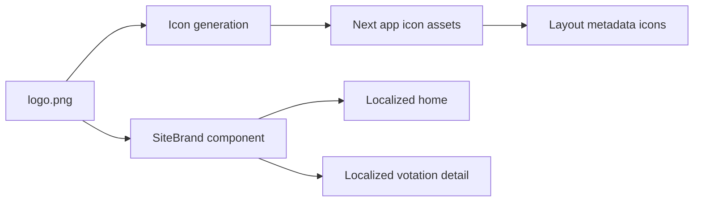

# Plan: intégration logo et favicons

## Contexte
- Le logo source est `logo.png` à la racine du repo, avec fond transparent.
- Le frontend Next.js ne déclare pas encore les icônes web (`favicon`, `apple-icon`, `icon`).
- Le branding UI est actuellement textuel et dupliqué dans les pages localisées.

## Objectifs
- Générer les icônes web standards à partir de `logo.png`.
- Déclarer ces icônes dans les métadonnées Next.js.
- Intégrer le logo dans l'interface avec un contraste robuste.
- Préparer le CSS pour une évolution claire/sombre sans refactor massif.

## Décisions principales
- Utiliser les conventions Next App Router via `frontend/src/app`:
  - `favicon.ico`
  - `icon.png`
  - `apple-icon.png`
- Introduire un composant `SiteBrand` réutilisable.
- Encadrer le logo transparent dans un conteneur `surface` avec bordure.
- Introduire des variables CSS de base (`--bg`, `--surface`, `--text`, etc.).

## Arborescence cible
- `docs/plans/PLAN-20260315-logo-favicon-integration.md`
- `frontend/src/app/favicon.ico`
- `frontend/src/app/icon.png`
- `frontend/src/app/apple-icon.png`
- `frontend/src/components/common/SiteBrand.tsx`
- `frontend/src/app/layout.tsx` (mise a jour metadata)
- `frontend/src/app/[lang]/page.tsx` (integration branding)
- `frontend/src/app/[lang]/votations/[id]/page.tsx` (integration branding)
- `frontend/src/app/globals.css` (tokens + styles logo)

## Modifications prevues
- Copier/generer les icones depuis `logo.png` aux dimensions web standards.
- Etendre `metadata` dans `layout.tsx` avec `icons` et `themeColor`.
- Ajouter `SiteBrand` avec `next/image` et lien vers la home localisee.
- Remplacer le branding texte duplique par `SiteBrand`.
- Ajouter styles CSS pour garantir lisibilite du logo sur fond clair.

## Contraintes securite impactees
- Aucun secret ni flux sensible introduit.
- Aucune nouvelle entree utilisateur.
- Changement limite au rendu frontend statique et metadata.

## Flux technique

## Verification post-generation
- [ ] `favicon.ico`, `icon.png`, `apple-icon.png` presents dans `frontend/src/app`.
- [ ] Les metadonnees Next referencent bien les icones.
- [ ] Le logo est visible sur la page liste et la page detail.
- [ ] Le contraste du logo reste lisible (fond transparent compense par conteneur).
- [ ] Le layout reste correct en mobile.
- [ ] Lint/TypeScript ne remontent pas d'erreur sur fichiers modifies.
